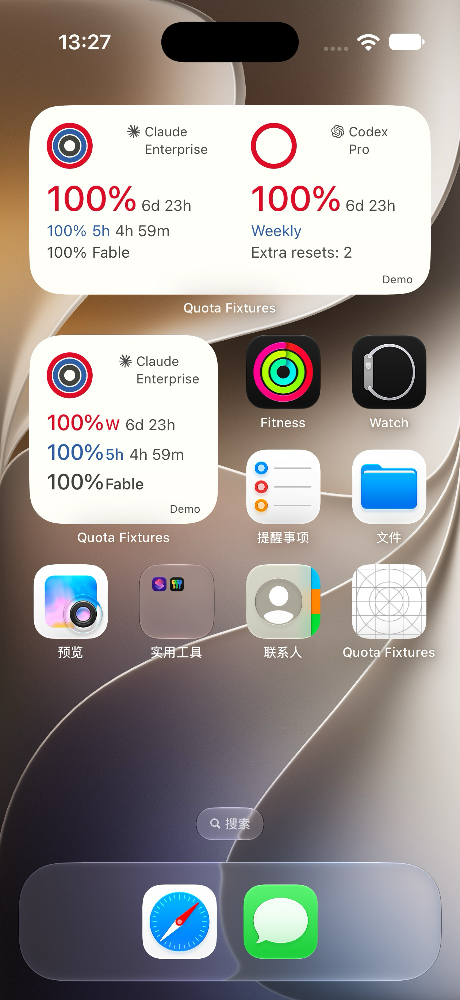
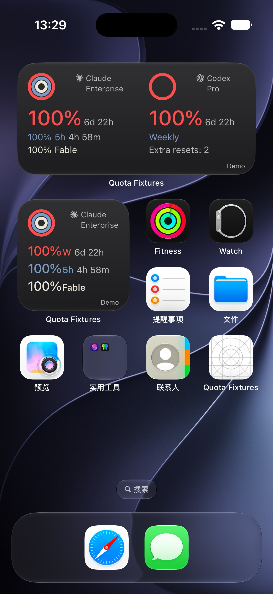

# Codex 额外重置次数与计划字段核验

2026-10-02。本轮沿用 PR #5252；不读取凭据，不调用重置消费接口。

## 官方与代码依据

- [OpenAI pricing](https://learn.chatgpt.com/docs/pricing)：Plus 20 USD/月；Pro 100、200、500 USD/月。价目表证明档位存在，不能证明当前账号档位。
- [OpenAI App Server / Rate limits](https://learn.chatgpt.com/docs/app-server#6-rate-limits-chatgpt)：`rateLimitResetCredits.availableCount` 是服务返回的剩余可用 earned-reset 数量；摘要缺失为未知；明细可能被截断，不能以数组长度替代次数。`credits` 是另一类余额。
- 同页 account/read 与 bucket 的 `planType` 为账号计划信息，示例 `pro`。此次未找到公开的 Pro 价格子档字段或有依据的编码映射。仅返回 `pro` 时显示 **Pro**，不推断 $100/$200/$500。
- Cindy 现有链路：`packages/maker-core/src/agents/codex/index.ts` 的 `readAccountRateLimits` → `AccountRateLimitsRead`；`packages/maker-core/src/types/account-rate-limits.ts` 的 `AccountRateLimitsResponse` 已含 reset 摘要；`apps/desktop/src/main/usage/codexRateLimitReset.ts` 的 `read` 已投影 `rateLimitResetCredits`；`packages/maker-shared/src/deviceLinkContract.ts` 的 `MobileCodexRateLimitsResult` 已有这个字段。
- 手机 `apps/mobile/src/widgets/readWidgetQuota.ts` 只提取正式 control 响应的 `availableCount`。旧 usage 缓存不提供该次数，保持未知；`planType` 可用 bucket、payload 或同一账号正式响应的 account 字段，均经过计划白名单。未添加服务端协议、OAuth 或新的 RPC。

## 实现规则

- OS 快照 v2 增加可选 `extraResetsRemaining`；不保存 credit ID、邮件、账号 ID、凭证或兑换 offer。
- 仅接受 Codex 的非负安全整数：缺失、null、字符串、负数、小数、非有限数、精度不安全值为未知；真实 0 保留 0；没有该字段的旧 v2 仍可读。
- 次数按账号观测时间独立过期，不使用某一窗口的 reset 时间。离线、15 分钟陈旧、撤权时显示 `Extra resets: —`，缓存重绘不更改源时间。
- Medium：第一行 32pt 周剩余百分比 + 14pt 小写倒计时；第二行 14pt Weekly 继续复用 Claude 5h 的 quotaSession 色；第三行 14pt Extra resets，删除重复 Reset。
- Small：主数字位置字号不改，倒计时移至 Weekly 后；第三行同样为 Extra resets。Claude、Grok 下方信息不改。品牌 12pt、圆环42pt/4.5pt与三行网格保持。
- 示例 Pro / 2 次只用于明确 Demo 的 fixture，不能当作用户真实账号返回值。

## 本轮验证

辅助AppKit度量：`Extra resets: —` 96.56pt、0为93.15pt、2为92.78pt、99为102.01pt；small `Weekly 6d 23h` 为97.22pt。主行遍历0–100%与完整周/5h分钟格式：最大144.62pt（100% + 20h 44m），保持32/14pt。原生截图另核对实际列宽和图标。

- TypeScript 配额投影与 controller：51 项通过。
- Mobile typecheck 通过。
- Swift 实际 codec/formatter：旧快照、0/2/99、负数/小数/超精度、过期/离线/未授权通过。
- macOS 离屏 SwiftUI：14 状态 × 两主题 × 3 provider；单卡辅助检查。不是 iOS 原生设备证据。
- 完整 iOS App/WidgetKit 构建通过，指纹 `5f8904917a99d0b4daf9a4c301dc18f35982e309` 与源码匹配。正式 Baguette 0.2.0 / iOS27.0 的 Air 与18 Pro复用原设备；模拟器非物理真机。

## 原生验证与公开截图

2026-10-02 13:27/13:29 CST，Air iOS27.0 的正式 SpringBoard WidgetKit 显示100%长内容、示例Pro和额外重置次数；以下均为合成数据，非真实订阅证明。日夜截图分别打开目检，32pt主数字、14pt次级信息、Weekly同5h主题色、完整图标及三行基线均已检查。

| Air / Day · Demo | Air / Night · Demo |
|---|---|
|  |  |

18 Pro在13:34/13:38 CST复用既有正式Cindy登录，完成真实源额度→手机→AppGroup→WidgetKit读取，验证small/medium显示正式返回次数。该账号计划返回unknown，因此隐藏套餐名；没有调用消费重置接口、没有读取凭据。真实数值和图片仅本地交付，不上传公开PR。临时仅计划字段诊断已从源码删除。

Air演示快照已清空并恢复完整Cindy App；18 Pro保持登录并恢复原来源电脑。调试Fast Refresh造成短暂离线时次数显示—，恢复读取后更新；这不是物理断网测试。全状态辅助图为macOS SwiftUI离屏渲染，不能代替这些状态在iOS上的逐个验证。

## CI 快照与范围

本轮开始一次读取旧 head `866607277`：Linux 两片、Windows 2/2、verify、Git、DCO 通过；Windows 1/2 因 `packages/maker-core/src/agents/pi/__tests__/pi-native-auto-compact.test.ts:393` 的350个长路径用例超过5000ms失败。已读取 job 110427474500 的失败日志；PR未修改 Pi 目录，本次原生文字与快照字段也不涉及此路径，不扩大修改 Windows/Pi。新 head 以推送后检查为准。

## 未验证与边界

Pro 价格子档未得到可靠来源，不显示；不会用额度、模型权限或 credits 推断。Duo runtime、物理真机、Android 原生编译、Grok 实际账号、第二个真实账号切换及真实断网恢复仍沿用未验收标记。PR 保持草稿，冷更/设计维护者把关未完成。

## 同轮主干同步

同步 `a9eb56b95` 主干：Claude快照类型已迁入 maker-shared，逐窗口可选observedAt随类型迁移保留；手机任务菜单使用主干新增的Claude/xAI读取能力，不保留旧不支持注释。词表同时保留Widget和Wallpaper条目，设计台账按合并源码重生成。没有把历史宿主模拟器补丁带入PR。

原生构建、四张截图对应UI提交 `905821cf5`；主干同步不改变widget Swift视图/快照/formatter，不能把该完整App构建记录泛称为合并后全App重建。合并后另外执行手机168项、桌面13项、共享9项定向测试及相关类型检查。
