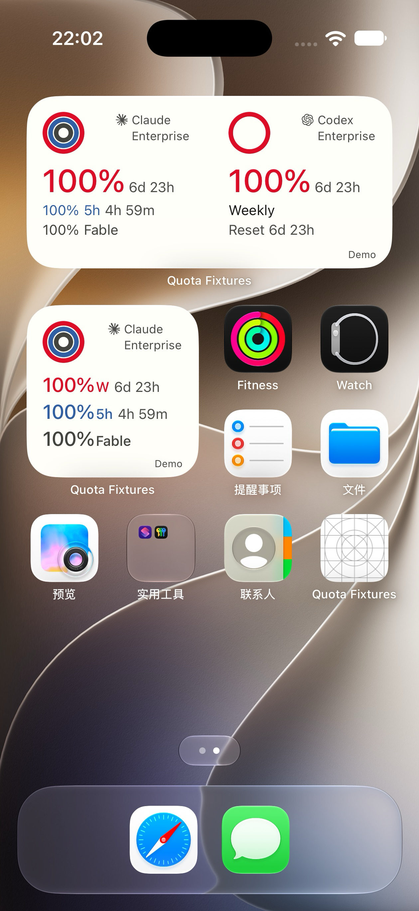
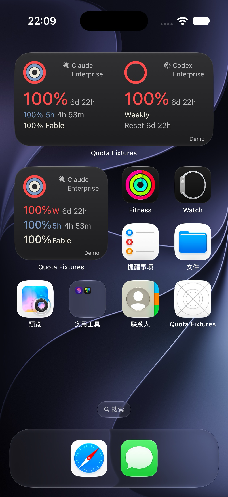

# 所有时长统一小写

2026-10-01。覆盖此前Codex/Grok的大写时长与Claude的5H标签约定，历史稿不回写。

## 实现

- 删除真实Swift `QuotaFormatting.duration` 的uppercase参数；所有provider的small/medium直接使用同一个小写d/h/m结果。
- 五小时窗口统一由 `QuotaFormatting.windowLabel` 返回 `5h`。W、Fable、Weekly、Reset和品牌保留正常大小写，没有全局转小写。
- medium32pt主周余量、14pt次级/倒计时、38/21/18行高、左16/顶66和品牌/圆环均未变。small仅按要求改文本大小写。
- 不改数据契约、观测时间、额度窗口或认证。未知/过期/离线语义不变。
- Android文本兼容层显示绝对重置日期，不存在本次大写倒计时分支；未新增Android倒计时，未声称Android原生已验证。

## 针对检查

- 编译并运行实际Swift formatter与快照codec：6d23h、4h59m、nil/过期、5h标签和Fable原名检查通过；0…10080分钟逐项确认输出无大写单位。
- Mobile原生插件9项测试、Mobile typecheck通过。
- 独立WidgetKit target构建成功。完整Cindy App构建成功并安装到Air与18 Pro；指纹 `d51e50b694fa7a2c0d705659172027648acfa7a0`。
- 辅助AppKit真实字体测宽：两家最宽主行均为 `100% 20h 44m`，144.6249pt；次级5h行112.56pt，Reset6d23h86.40pt。没有缩字/裁剪。
- macOS辅助SwiftUI使用真实生产视图：small三家日夜，medium12状态×两主题×三家已渲染并查看；明确不是iOS运行截图，Grok仍无真实账号。

## 证据边界

使用原任务Baguette 0.2.0独立Air/18 Pro、iOS27.0；不是物理真机。18 Pro保留既有登录，通过已有来源电脑正常读取Claude/Codex；真实截图不公开到PR。该源本次Codex为95%、Reset6d22h，首次Claude缓存显示Outdated；下一次正常前台读取成功后恢复98%周/98%5h/96%Fable，已保留恢复前后真实图，不伪造刷新。Air仅合成快照，本轮100%日夜原生图已查看：medium和Claude small均为小写；夜图倒计时自然推进至6d22h。快照已实际确认清空为0 providers。Air转场停帧，经正式Baguette单次恢复SpringBoard后完成截图；没有操作18 Pro认证。已恢复完整App与原浅色设置。

旧32pt原生截图仍留在 `../subscription-widget-weekly-emphasis/`，其大写文案不代表当前实现。新的平铺画布将真实原生图和辅助状态图分区标注；390px浏览器7张图片全部加载、无页面横向溢出，已实际查看。该检查仅代表画布本身。

原有待验收项不变：维护者冷更/设计批准、第二真实账号、实际断网恢复、Duo27.1runtime、Android编译、Grok真实账号及物理真机。PR保持draft，不合并发布。

## 本轮Air原生截图（合成数据）

| Light | Dark |
|---|---|
|  |  |

辅助状态全集另存 `All-Providers-Medium-States-SwiftUI.png` 和 `All-Providers-Small-SwiftUI.png`；二者明确标记macOS离屏渲染，不冒充SpringBoard。
