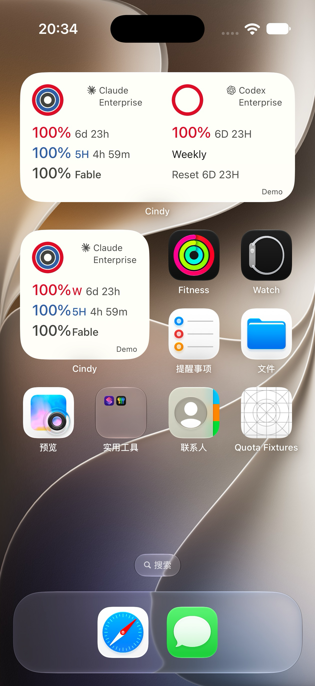
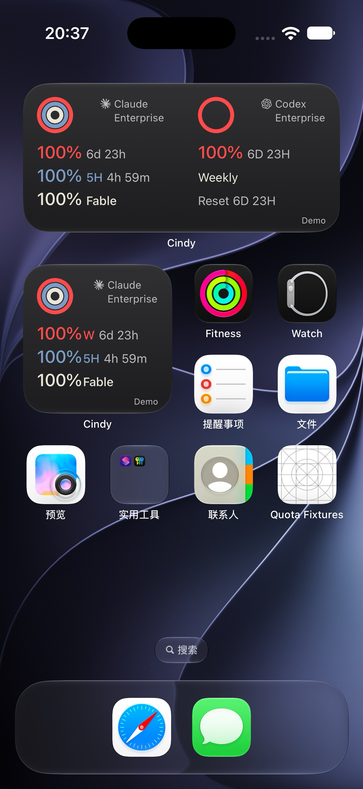

# Medium 三行布局与原生验证

2026-10-01；PR #5252 的后续改动，仅调整 medium 信息区。旧稿保留，small、共享圆环、品牌/计划区和数据同步语义不改。

## 统一规则

真相源为 `apps/mobile/src/theme/quotaWidgetTokens.ts`，生成器同步到 `QuotaWidgetResources.swift`，两家共用 `mediumLine` / `mediumQuota`，没有品牌专用字号。

| 项目 | 规范 |
|---|---|
| 各列信息左边缘 / 顶部 | 16pt / 68pt |
| 所有百分比 | 20pt medium |
| 标签、倒计时、Weekly、Reset | 14pt；保持英文 |
| 每行高度 / 行间距 | 24pt / 3pt |
| 值与后续文字间隔 | 4.5pt |
| 基线 | 每行使用相同 20pt 隐藏参考字形与 firstTextBaseline 对齐，隐藏字形不进入无障碍树 |
| 上方框架 | 保持 42pt 外环、中心(37,37)、4.5pt 线宽和 12pt 品牌/计划 |

Claude：第一行周百分比后直接跟时长；第二行 5H 百分比与时长；第三行实际返回的 scoped/Fable 信息。Codex：第一行周百分比与大写时长，第二行 Weekly，第三行 Reset 时间。用户指定的两处 Codex 时长均保留。

缺窗口保留对应空行，不把仅 5H 误标 Weekly；缺 reset 显示 `—`，Fable 不添加虚构时长。未知不变为 0%；Outdated/Offline 是数据状态，不当作额度 reset。没有缩字、裁字或省略号来隐藏溢出。

## 原生证据

正式 Baguette 0.2.0，Xcode 27.0 / 27A266a，iOS 27.0 模拟器。下表是 SpringBoard 中的真实 WidgetKit，不是网页或物理真机。

| 设备 | 本轮范围 | 数据与恢复 |
|---|---|---|
| iPhone Air，420×912pt | 最长内容日夜、0、unknown、Outdated、缺 reset、仅 5H | 离线原生夹具输入；使用本轮生产 WidgetKit 扩展和原生快照 Store；测试后清空夹具快照并恢复完整 Cindy、浅色设置 |
| iPhone 18 Pro，402×874pt | 新 medium 的真实 Claude/Codex 部分额度、日夜、三行对齐 | 完整 Cindy 更新后既有登录保留；没有装夹具、重新登录或读取凭据；恢复原深色设置 |

逐图打开检查了行位置、文本完整性、品牌 SVG、圆环和桌面图标。两列第一行字号相同，二、三行视觉基线一致；这里不把目检描述为逐像素基线测量。

公开图片仅包含 Air 合成数据。Enterprise 是长计划排版边界，不证明某个 Claude 订阅账号实际返回此计划；Fable 也是测试输入，不代表所有计划拥有此窗口。`Quota Fixtures` 通用网格 App 图标属于测试宿主，provider 图标完整。

| Air · longest light | Air · longest dark |
|---|---|
|  |  |

18 Pro 真实账号截图、其余边界截图及包含这些图片的自包含平铺 HTML 仅保留任务本地，不上传公开 PR。系统图标、壁纸和品牌标识仍属于其各自权利人。

## 宽度与回归

使用真实 `QuotaFormatting`，枚举百分比 0…100、周窗口分钟 0…10080、5H 分钟 0…300，以 AppKit 字体测宽作为补充：

| 内容 | 实测最宽字符串 | 宽度 |
|---|---|---|
| Claude 周行 | `100% 20h 44m` | 115.28pt |
| Codex 周行 | `100% 20H 44M` | 117.48pt |
| 5H 行 | `100% 5H 4h 44m` | 130.85pt |
| 指定 Codex 第三行 | `Reset 6D 23H` | 90.13pt |

这是 macOS 字体度量，不冒充 iOS 测量；字符数最长不必然最宽。补充 SwiftUI 渲染按保守 158pt 列宽检查，扣左右 16pt 的理想内区为 126pt，最宽 5H 行会超出该理想内区 4.85pt，因此不宣称任意 158pt 列宽都保留双侧 16pt。实际验收的 medium 列更宽：18 Pro 约172pt、Air约180pt（350/366pt卡宽减6pt列间距后各半），对应双侧16pt内区140/148pt；原生最长示例没有溢出。small 原布局不在本轮调整范围。

- 插件相关 9 项测试通过；Mobile typecheck、Swift codec 契约通过；`git diff --check` 通过。
- `pnpm mobile:sim:rebuild -- --build-only --force-build` 完整 App 构建退出 0，包含 WidgetKit 扩展。
- 新原生指纹：`0b129afcc9e9dd2de30e1e7e16ae753042fa20f7`；生成工程中的 Widget Swift 与源文件一致。
- small 修改前后辅助 SwiftUI PNG 字节一致：SHA-256 `f5cfd348da7d8a75e2fc0b0c9505d1564782eb543e2ed67b44255a2969b0c8c4`。
- 辅助 macOS SwiftUI 渲染覆盖 12 场景 × 日夜 × 3 providers，不计为 iOS 设备用例。
- 未重跑历史 7745 项全量测试；该历史结果不代表本次 head。

## 仍未完成的整体验收

PR 保持 draft，不合并、不发布。仍需维护者冷更/设计确认；不同真实 Cindy 账号、实际断网恢复、物理真机、系统染色及长期刷新预算未验证。Duo 本机缺 27.1 runtime；Android 仍为文本兼容且未 SDK 编译；Grok 无真实账号。以上不因本轮 medium 原生验证完成而消除。
