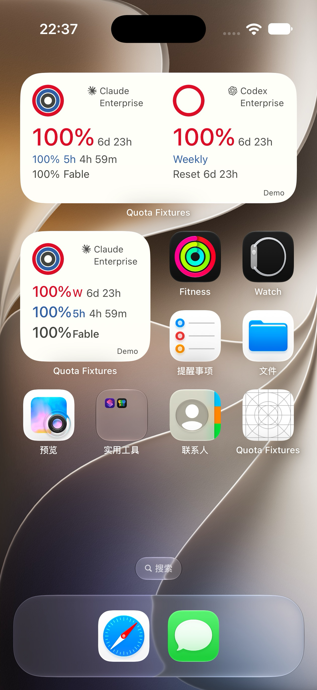
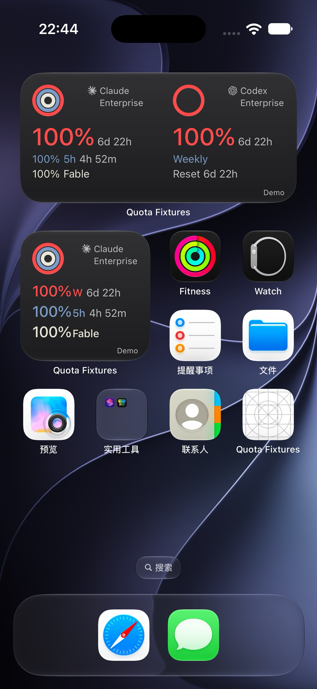

# Codex Weekly 复用 Claude 5h 主题色

2026-10-01。仅修改生产SwiftUI中small和medium的Codex Weekly标签颜色，两处均直接使用`QuotaLayout.tint(1, dark: dark)`，即Claude 5h同一`quotaSession`语义token：Light #315FA5、Dark #7C9BC7。未另选相近颜色，Grok不扩改。

32pt主周百分比、14pt次级信息、小写d/h/m与5h、行高、基线、圆环、品牌、Reset和其他文字颜色均保持。

实际Swift快照/formatter契约、Mobile typecheck通过；完整Cindy iOS模拟器App与内含WidgetKit扩展构建成功，native fingerprint `7646f614a50919519aa5a18881191e0846d3b05e`。构建日志在本任务`.build/widget-implementation-audit/weekly-color-ios-build.log`，未公开账户数据。

正式Baguette 0.2.0 / iOS27.0：Air合成100%长计划日夜图已逐张查看；18 Pro完整App保留既有登录，真实Claude/Codex双列及Codex small日夜截图另存本地。二者是原生SpringBoard截图，不是物理真机；不是同一组数据。Air倒计时随时间推进，不能将夜图描述成固定6d23h。示例Enterprise/Fable不代表实际套餐契约。

Air复制测试扩展时补齐本地模拟器AppGroup签名，未修改生产签名配置；输入停帧经正式工具恢复Air SpringBoard。合成快照已从界面核实Clear / 0 providers，随后恢复完整Cindy App。18 Pro不重复登录、不退出账号。

辅助macOS SwiftUI状态图覆盖small与medium的日夜/最长/0/unknown/outdated/缺失等分支，仅作视觉辅助，不冒充本轮iOS异常用例重跑。旧稿全部保留。Duo runtime、Android原生编译、Grok真实账号、第二真实账号及物理断网恢复等历史缺口不变；PR继续draft，等待冷更/设计批准，不合并发布。

| Air · synthetic · Light | Air · synthetic · Dark |
|---|---|
|  |  |
