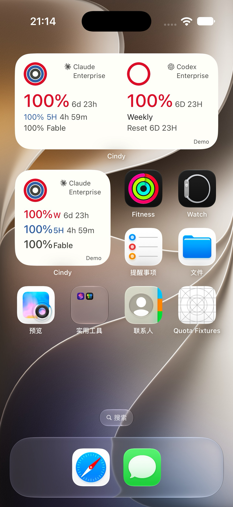
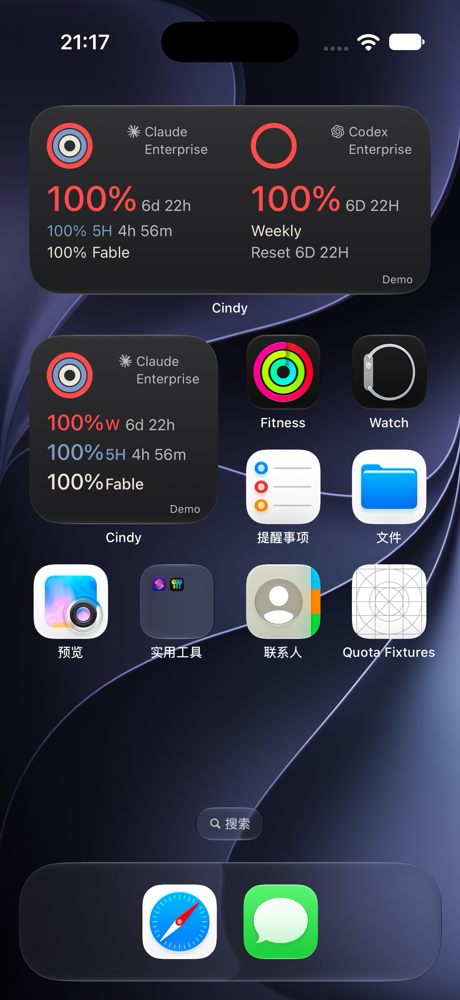
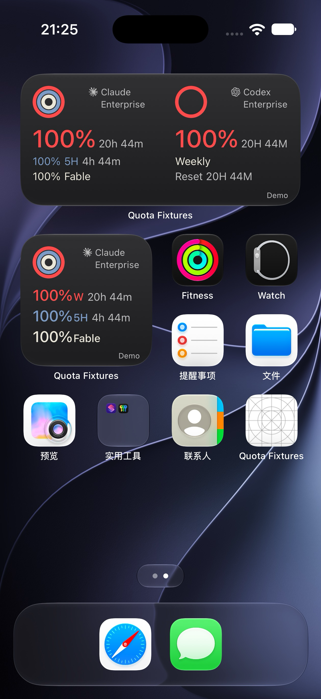

# 周余量32pt：恢复原Codex层级

2026-10-01。按用户最新修订替代 `60310f4fd` 的 medium 统一20pt方案；旧稿、small和品牌框架均保留。

## 字号依据与最终规则

核对 `ab680888f` 的 `CindySubscriptionWidget.swift`：原Codex主百分比是 `.system(size: 32, weight: .medium)`，主行38pt、Weekly行21pt、Reset行18pt，信息顶部66pt。不是此前浏览器探索稿里的40pt。

| medium信息 | 新版 | 与原Codex关系 |
|---|---|---|
| Claude/Codex周余量 | 32pt medium | 两家均恢复原Codex主数字规格 |
| 第一行重置时长 | 14pt regular，主数字后3pt间隔 | 保留小字，主数字不缩放 |
| Claude 5H百分比/标签/时间 | 全部14pt regular | 对齐Codex Weekly的次级层级 |
| Claude Fable百分比/标签 | 全部14pt regular | 对齐Codex Reset的次级层级 |
| 三行高度/额外间距 | 38 / 21 / 18pt；额外间距0 | 沿用原Codex层级，两列共用 |
| 信息锚点 | 各列左16pt、顶66pt | 左对齐；不把Claude移向右列 |

共用 feature tokens 与每行基线参考。右上图标、品牌/计划、42pt圆环、颜色、small代码均不变。缺周窗口不假称Weekly；缺reset保持 `—`；Fable未返回时间时不编造。Codex第一行和第三行继续同时保留重置时间。

## 宽度

使用真实格式化函数枚举周分钟0…10080、5H分钟0…300、百分比0…100，以AppKit系统字体测宽作辅助，而非冒充iOS测量：

- 最大32pt百分比 `100%`：83.03pt。
- Claude最宽周行 `100% 20h 44m`：144.62pt。
- Codex最宽周行 `100% 20H 44M`：146.83pt。
- 14pt次级5H行约115.15pt；`Reset 6D 23H`为90.13pt。

18 Pro medium约350pt、6pt列间距，每列约172pt，从左16pt到列右边界有156pt；最宽行剩约9.17pt。Air约366pt，每列180pt，剩约17.17pt。第一行采用3pt间隔，没有通过缩小32pt百分比或14pt时长适配。最宽字符串会占用原先理想右16pt中的一部分，因此不声称18 Pro两侧仍都有16pt留白。

Air实际SpringBoard的最宽组合已逐图目检。更窄机型尚未原生验证；本轮不声称所有medium尺寸都通过。辅助158pt列渲染不是该最宽组合的通过证据。

## 设备与数据

正式Baguette 0.2.0、Xcode27.0/27A266a、iOS27.0模拟器；非物理真机。

- Air：本轮生产WidgetKit扩展，离线测试夹具写入合成数据。100%日夜、最宽20H44M、0、unknown、Outdated及缺reset已实际查看。倒计时会正常流逝，深色主图的6D22H来自6D23H示例之后的时间推进。
- Enterprise/Fable是排版测试输入，不证明所有Claude订阅支持这些字段。夹具App的网格图标不是provider图标缺失。
- Air输入曾停滞，释放输入后仍未生效，使用正式Baguette仅恢复Air SpringBoard；没有修改宿主补丁或操作18 Pro登录。夹具快照已确认清空为0 providers。
- 18 Pro真实账号证据仅任务本地交付，不进入公开PR。完整App回装后保留登录，已取得新版双供应商日夜SpringBoard截图。原选电脑只返回Claude；通过正常UI选择另一台已连接电脑后，真实返回Claude 98%/88%/Fable 97%、Codex 100%及6D23H，计划缺失正常隐藏。仅切换数据来源，没有读取或转移凭据；验证后恢复原来源。图片不进入公开PR，不把Air夹具称为真实账号联调。

| Air · Day | Air · Night |
|---|---|
|  |  |

## 针对验证

- 插件9项通过；Mobile typecheck通过；实际Swift快照codec契约通过。
- 独立WidgetKit原生target构建成功，包含arm64/x86_64。完整Cindy App构建成功并通过正式Baguette安装到Air和18 Pro；原生指纹 `81568f554abdd52d39696e2c5014182404969807`。
- small前后辅助SwiftUI截图SHA-256相同：`f5cfd348da7d8a75e2fc0b0c9505d1564782eb543e2ed67b44255a2969b0c8c4`。
- 12场景×两主题×3 providers的辅助macOS SwiftUI渲染完成，明确不作为iOS设备证据。
- 完整App首次准备依赖时Hermes远端探测失败，退回源码路径后报缺cmake；使用本机已有同版本官方Hermes预编译缓存重建，没有改系统工具链、依赖版本或生产配置。

本轮不重跑历史7745项全量测试。保持同一PR草稿；冷更/设计把关、不同真实账号、实际断网恢复、物理真机、Duo缺27.1runtime、Android未SDK编译和Grok无真实账号等原有边界仍保留。不合并、不发布。
