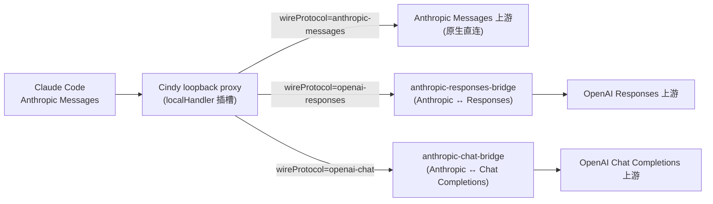

# Claude Code 多协议桥接（Anthropic / Chat Completions / Responses）

> 状态：已实施（2026-07）。
> 范围：Claude Code 自定义供应商的 wire 协议扩展 —— 在原有 Anthropic Messages 直连之上，
> 支持经本地桥接使用 OpenAI Chat Completions 与 OpenAI Responses 上游。
> 相关现状：[`openai-chat-dual-channel-plan.md`](./openai-chat-dual-channel-plan.md) 记录 Codex
> 侧的 Responses → Chat 桥接；本文是 Claude Code 侧的对应物。

## 1. 目标与最终结论

Claude Code 只会说 Anthropic Messages 协议，此前内置的自定义供应商对 `claude-code` runtime
只允许 `anthropic-messages` 一种 wire（UI 不渲染协议选择器、后端校验白名单锁定）。Codex 侧
早已支持三种协议（原生 Responses / Chat 桥接 / Anthropic Messages 桥接），Claude Code 侧缺
少同等的协议选择与对应的本地翻译器。

本轮补齐：

实施边界：

1. **不引入第二套常驻代理。** 沿用 compat-proxy 的 `RoutingDecision.localHandler` 插槽，
   bridge 为进程内 handler，消息流不多跳。
2. **不串联已有桥。** Chat 通道是**直接转换器**（Anthropic → Chat 单向成对），不是把
   responses-anthropic-bridge 与 responses-chat-bridge 串起来走两跳。
3. **数据驱动选协议。** 协议由 `RoutingDescriptor.wireProtocol` 声明，路由按描述符分发；
   禁止按 provider id 堆条件分支。
4. **同协议永远优先透明直连。** `anthropic-messages` 保持原转发语义（字节级不变），只有
   非 Anthropic 上游进入本地桥。
5. **桥接不等于原生完整兼容。** 产品 UI 明确区分「原生 / Cindy 桥接」，help 文案标注降级
   能力（见 §4）。

## 2. 现状基线

- 协议枚举：`ProviderWireProtocol = 'anthropic-messages' | 'openai-responses' | 'openai-chat'`
  （`packages/model-providers`），自定义供应商配置（`CustomProviderRuntimeConfig.wireProtocol`）
  与路由描述符（`RoutingDescriptor.wireProtocol`）早已支持，无需改类型。
- Codex 侧三种协议全支持（`codex-proxy-host.ts` 的 `createLocalBridgeDecision`），本轮不动。
- Claude Code 侧原缺口：
  - UI：协议选择器只在 codex tab 渲染（`CustomProviderDialog.tsx`），claude-code tab 无选择；
  - 校验：`custom-provider-store.ts` 的 `validateRuntime` 对 claude-code 白名单仅
    `['anthropic-messages']`；
  - 运行时：已有 `anthropic-responses-bridge`（Anthropic ↔ Responses），但只注册
    chatgpt/xai 官方订阅源（模型前缀 `chatgpt/`、`xai/`），自定义供应商的 Responses
    上游无接入路径；**没有 Anthropic → Chat Completions 转换器**。

## 3. 实现

### 3.1 新包 `packages/anthropic-chat-bridge`

进程内协议翻译 handler（`createAnthropicChatHandler`），结构对齐
`packages/anthropic-responses-bridge`：

- `translate-request.ts`：Anthropic Messages → Chat Completions。system 合并置首；
  user 消息按 block 顺序拆出 `tool` 消息（tool_result 独立成 `role:'tool'` 消息，原 user
  文本保留原位，天然满足 Chat 的交替要求）；assistant 的 text / tool_use / thinking 合并进
  一条 assistant 消息（content + tool_calls + reasoning_content）；thinking 请求经
  `capabilities.reasoningField` 映射（默认不发）；max_tokens 经 `maxTokensField` 映射。
- `translate-sse.ts`：Chat SSE → Anthropic SSE 状态机。content → text 块、reasoning_content
  → thinking 块（惰性开块，防纯空白块回放 400）；**tool_calls 累积到流尾一次性输出**——
  Chat 流没有「单个工具 arguments 结束」的显式信号，逐 delta 转发会违反 Anthropic 单开块
  不变量并产生残缺 tool_use，延迟输出以完整 arguments 保证工具可执行；usage 尾帧 →
  message_delta。
- `handler.ts`：compat-proxy `localHandler` 形态；count_tokens 本地估算；上游错误转 Anthropic
  error 形状；`x-ratelimit-*` 头回调；零事件流合成诊断 error（#941 同口径）。
- capabilities 全部数据表达、默认 fail-closed（DeepSeek/Kimi 的 `reasoning_content` 回放、
  占位等按上游确认后开启）。

### 3.2 host 装配（`apps/desktop`）

- `maker-host/anthropic-chat-bridge-host.ts`：`createClaudeChatBridgeDecision(route)` —— 为
  已解析的 Claude Code 会话路由装配 chat bridge（`buildLocalHandlerHeaders` 同源构造
  鉴权头，`reportProviderUpstreamError` 喂回错误广播通道）。
- `maker-host/anthropic-responses-bridge-host.ts`：新增
  `createClaudeResponsesBridgeHandler(route)` —— 为自定义供应商的 Responses 上游装配
  responses bridge（原 `getResponsesBridgeHandler` 保持订阅直连专用）。
- `maker-host/anthropic-compat-proxy-host.ts` 的 `createModelRoutingTransform`：① 段
  （per-session 路由）在 `getSessionRoutingDescriptor` 预判 wireProtocol（同步、不读凭证），
  命中 `openai-chat` / `openai-responses` 时走 `resolveSessionRoute` 异步解析并返回
  `localHandler`；未命中保持原 `resolveSessionRouteDecision` 透明转发；② 段 spawn 默认
  路由提取为闭包，local-bridge 分支解析失败时回落（no-break）。

### 3.3 UI / 校验

- `CustomProviderDialog.tsx`：协议选择器从 codex-only 改为两个 tab 都渲染；
  `changeCodexWireProtocol` → `changeWireProtocol(agent, protocol)`；requestPath placeholder
  按所选协议推导。
- `lib/customProviderWireProtocols.ts`：`CUSTOM_PROVIDER_CODEX_WIRE_PROTOCOLS` →
  `CUSTOM_PROVIDER_WIRE_PROTOCOLS`（双 agent 共用；类型本就是 `ProviderWireProtocol` 全集）。
- `custom-provider-store.ts` `validateRuntime`：claude-code 白名单放宽为三种协议。
- i18n（zh-CN / en）：协议 label 与 help 文案改为双 agent 通用；`claudeDesc` 补充协议说明。

## 4. 能力边界（已知降级）

| 通道 | Claude Code 侧 |
|---|---|
| Anthropic Messages（原生） | 全能力，字节级透传 |
| OpenAI Responses（桥接） | 文本 / 工具调用 / 图片 / reasoning（encrypted_content 回放经
  `anthropic-responses-bridge` 既有约定，effort / Fast 由 host 会话态闭包注入） |
| Chat Completions（桥接） | 流式文本 / 函数工具调用 / thinking（reasoning_content）；工具
  calls 非逐字流式（累积后块级输出）；无 signature 的 thinking 不回放下游（默认丢弃历史
  thinking）；厂商扩展参数（reasoning_content 回放等）按 capabilities 逐厂商开启 |

## 5. 测试

- `packages/anthropic-chat-bridge/src/__tests__/`：请求翻译（消息拆分、图片、tools、
  tool_choice、max_tokens、thinking 映射、占位注入）与 SSE 翻译（文本/思考/工具流、
  usage 尾帧、stop_reason 映射、空白块、失败收尾）单测。
- host 侧改动沿用现有 proxy 路由单测（`providerRoute.test.ts` 等）验证 no-break。
