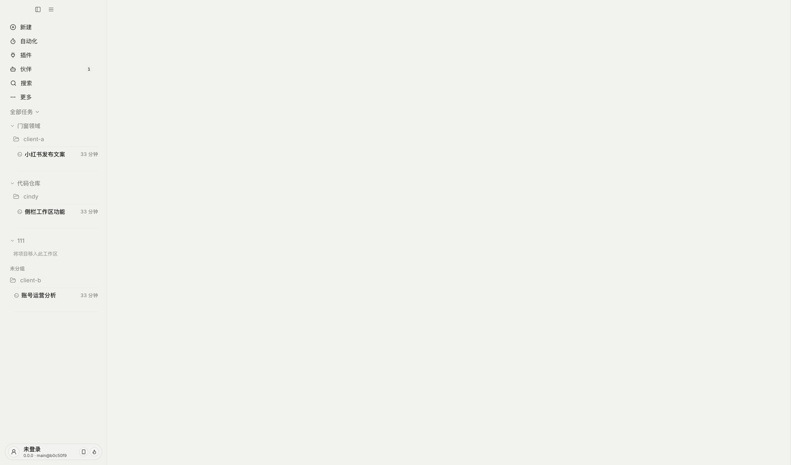
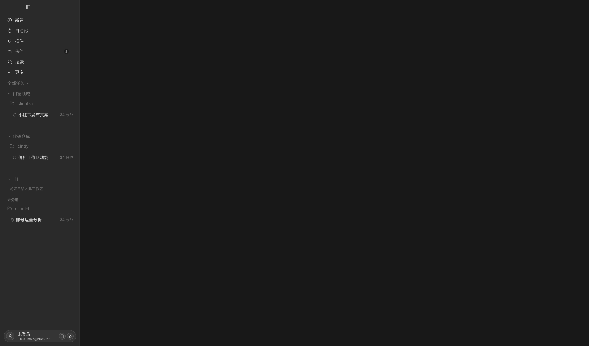

# 侧栏工作区分组验证

平台：macOS arm64，Electron 开发版；隔离目录 CindyGlobal-dev2-workspace-groups，使用“跳过登录”的本地模式。项目和任务使用验证数据，不调用模型，也未读取正式版任务数据。

## 设计依据

沿用 docs/design-rules/DESIGN.md 的主题语义色、侧栏文字层级、§5 圆角与目标尺寸、§4 表单／确认弹窗和 §14.6 图标按钮可访问名称与提示。工作区是项目上方的命名层，设备分组仍在最外层。

## 已完成的交互验证

- 从空账号侧栏新建工作区；名称字段自动获得焦点，保存后显示空组。
- 通过项目菜单移入已有工作区，以及新建工作区并移入。
- 通过 Chromium 实际鼠标事件将项目跨组拖动，并重新读取 Main 存储核对归属。
- 收起工作区后打开组内任务，工作区自动展开且活动任务可见。
- 删除临时工作区后，项目回到未分组；原任务仍能读取，验证目录仍存在。
- 正常重启隔离开发版后已有工作区读回。

## 自动验证

工作区持久化、账号代次、预加载桥接、表单失败重试、项目分组、跨列表拖拽及已有排序／折叠相关的 16 个测试文件共 244 项通过；Desktop TypeScript 检查通过。国际化覆盖当前五种语言，术语登记为 proposed。

审查后补充任务定位的 6 个回归用例，覆盖工作区与项目均收起、仅项目收起、项目已展开、当前任务手动再次收起、延迟加载与平铺模式。修复前 4 项失败，修复后全部通过；打开另一项任务会同时展开所属工作区和项目，同一任务上的手动收起保持不变。本次补修未重新启动开发版做实机重验。

对所有修改和新增 TypeScript 文件执行 ESLint，报出 22 项错误，全部来自三个既有文件。分别将 HEAD 中的原始内容通过 ESLint stdin 重新检查，bootstrap-electron.ts 为 6 项、CCAgentSidebarUpper.tsx 为 11 项、ProjectsSection.tsx 为 5 项，规则与错误消息一致。没有修改这些与本功能无关的基线问题，也不将完整 lint 记为通过。

## 明暗主题截图

已在实际 Electron Renderer 中切换现有主题偏好、重新加载并目检：

## 验证限制

尚未在 Windows 或两台真实设备上进行实机验证；移动端未新增工作区界面。多窗口拖拽期间外部变更的 DOM 回归由组件测试覆盖，不宣称已经完成两台设备的实际互联测试。
