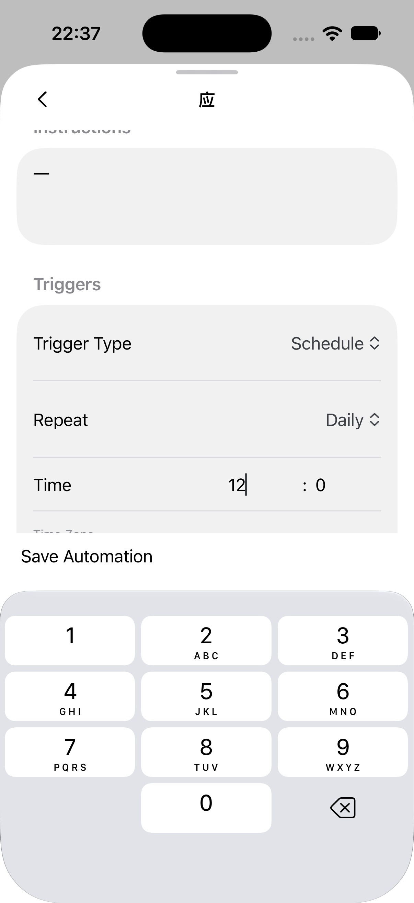
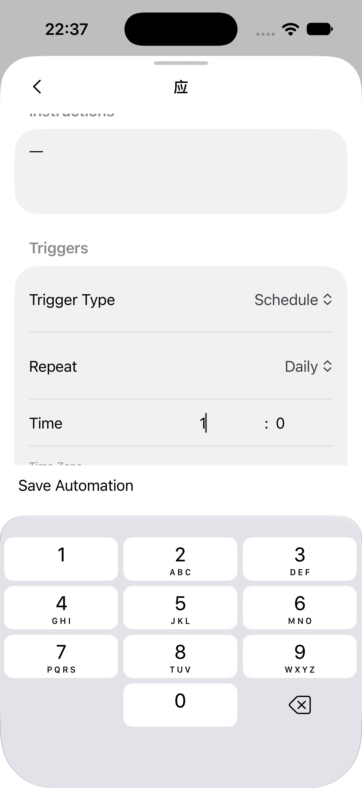
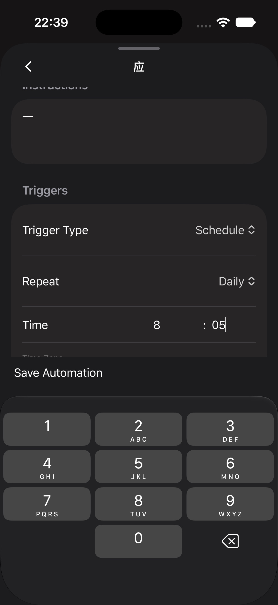

# iOS automation input regression evidence

Issues: #4876, #4877.

- Environment: iOS 27 simulator, 402 × 874 points, current native development build; branch `fix-4876-4877-automation-input`, Metro served by that worktree.
- These are actual native controls, not design mockups. The production automation sheet was mounted with a temporary local resource fixture because the paired host timed out. The fixture and temporary route were removed before committing. No automation was created or executed on the host.
- Chinese Pinyin composition in Name was committed as `应`; Instructions then accepted `一`, and Enabled could be toggled off.
- Actual on-screen numeric keyboard taps: hour `9 → empty → 12 → 1 → empty → 8`; minute `0 → empty → 30 → 3 → empty → 05`. The screenshots record the full two-digit value, deletion and subsequent entry, in Light and Dark.
- Automated component tests separately exercise the actual sheet/native-view composition and remote action arguments, dirty/clean refresh, server rejection, and trigger/filter changes.
- Not verified: the reporter’s iPhone 17 / iOS 26.0.1 with its third-party keyboard; live host persistence/next-run readback after this change; Android device. The original failure was not reproduced on iOS 27 before the change. These screenshots establish the replacement native path works on this simulator, not a reproduction of the original environment. The development build label was not captured in these sheet screenshots.

| Hour entered | Hour deleted | Minute re-entered (Dark) |
| --- | --- | --- |
|  |  |  |
