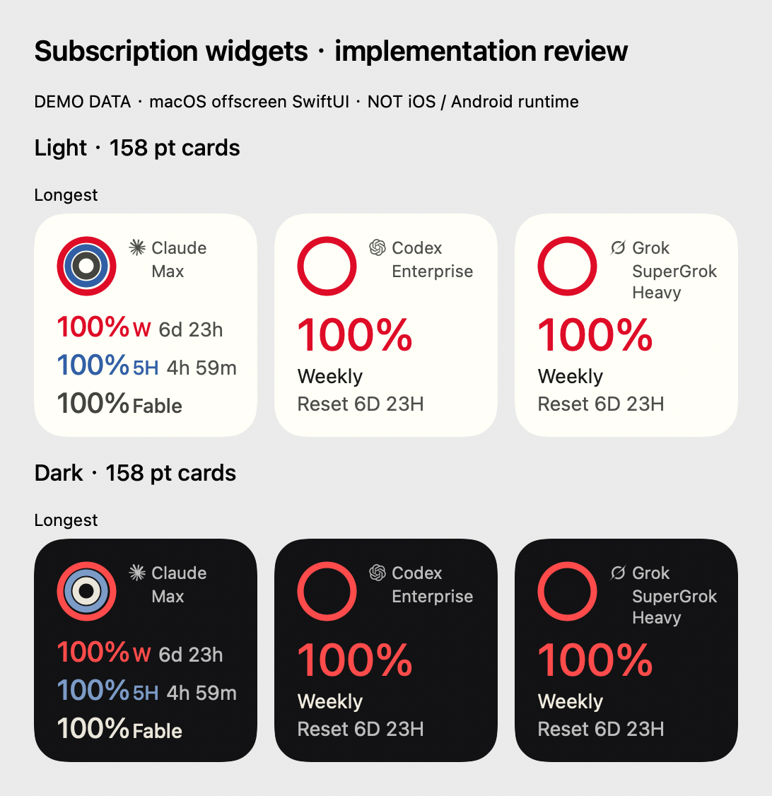

# 订阅额度小组件：实现与验收记录

更新：2026-10-01。任务分支 `cindy/sweet-bohr`；初始审计主干 `f7f265ef2e4316d37a7ce6d4e03006a826e397e4`，本轮已合入主干 `36420c470`。

**Air与18Pro已完成部分真实WidgetKit运行验证；真实账号端到端、字体缩放等仍未完成，不能宣称已发布或全面适配。** 原 Claude 确认稿与全部历史设计保留。本 PR 不包含先前未获授权的模拟器宿主补丁。

## 主干同步与 Windows 回归

已保留新版主干设置页结构、设备名/语音词典子路由与台账人工记录，只补回小组件入口和登记。历史宿主补丁在合并前后字节一致，不进入PR。

上一提交 `eba687b0a` 的Linux两片、verify、Windows第一片、Git集成和DCO均通过；Windows第二片失败确为本PR生成资源未约束checkout换行。Swift/XML在Windows `core.autocrlf=true` 下转成CRLF，严格生成器检查因此报陈旧。现在只为这些生成文件固定LF，没有放宽字节比较。新增隔离Git仓库回归先复现失败，再验证修复；普通对照文件仍转成CRLF，证明实际覆盖Git转换而非字符串模拟。

9月30日额度/通道/排版定向99项、设置页13项、台账52项、Mobile scope与Mobile/Desktop类型检查通过；新增native插件组9项通过。未重跑无变化的Mobile全量7745项；该结果明确属于此前提交。推送后的远端CI以PR最新head为准，不轮询等待无变化结果。

## 基础审计与实现边界

| 层 | 主干已有 | 本次补齐 | 验收范围 |
|---|---|---|---|
| 授权与供应商读取 | 已配对 device-link、现有 OAuth 账号、Claude 主动 control read / SDK 缓存、Codex control read、Grok 订阅读取 | 手机使用现有只读调用；不添加 OAuth、不读取/保存供应商凭据 | 合成数据契约；未调用真实账号 |
| Claude 时间 | 聚合 updatedAt；增量事件可能只更新一个窗口 | 逐窗口 observedAt；保留未更新窗口原时间；旧 mixed cache 未知时间不补 now | 3 个新增时间测试 + 10 个现有主动读取测试 |
| 手机投影 | 通道及连接生命周期 | 最多每供应商一个已连接账号；返回后再次核对选择；v2 脱敏 schema；计划严格白名单；最多16个实际窗口 | Mobile 定向测试43项，类型检查通过 |
| 本地并发 | 身份 generation 与设备撤权事件 | epoch 隔离、同代查询合并、串行缓存写入；退出/换账号/换电脑先清原生快照；撤权恢复隔离 | 11个 controller 测试包含迟到响应与撤权恢复 |
| iOS 原生 | Expo 原生工程 | App Group + 原子文件；3个独立 small + 1个 medium（前两家）；所有 kinds 同步 reload | WidgetKit扩展和完整宿主构建；Air/18Pro的SpringBoard分层验证，真实账号链路待验 |
| Android | Expo 原生工程 | 同一v2契约、AtomicFile无备份缓存、原生AppWidget文本布局和点击入口 | 尚未SDK编译/运行；不是iOS圆环设计的视觉验收 |

不跨仓修改服务端，不新增后台音频、轮询服务或后台权限。手机需已登录 Cindy 并选择已配对电脑；供应商认证仍留在电脑。

## 新鲜度与状态契约

- 手机进入前台、连接恢复/在线状态改变触发读取，前台另有60秒兜底。并发请求共享同一 flight；后台使旧请求失效并保留最后快照与源时间；正常退后台不冒充读取失败。只有前台链路不可用或真实读取失败标记 offline，缓存仍按原观测时间到期。**不是后台60秒更新**。
- Claude 宿主现有主动读取节流180秒，失败退避；SDK事件也能更新窗口。手机取到宿主缓存必须保留原时间，不把手机读取时间作为源更新时间。
- Codex正式 `account/rateLimits/read` 每次走control请求，无本地响应缓存替代；本次响应观测时刻可用手机now。旧版本fallback只用于内置账号，保留payload.updatedAt；账号不匹配不fallback。
- Grok只投影现有订阅读取返回的creditUsagePercent及resetsAt，不拿API余额或token消费作订阅剩余。本轮没有Grok账号实测。
- 15分钟为本功能的保守陈旧阈值，非供应商官方有效期。源端时间未知显示“—”；0是真实0；到达reset只显示Updating，不能自动补满100%。
- WidgetKit本地分钟entries更新时长，15分钟后请求下一timeline；Android `updatePeriodMillis=1800000`。两者均**只重绘缓存，不查询供应商**，OS也不保证按请求间隔执行。
- no-windows、读取失败、unsupported、unauthorized分别保留状态。未登录/禁用清空缓存；撤回供应商授权需由在线手机再次读取发现，手机长期离线不能即时得知电脑端撤权，陈旧遮蔽作为兜底。
- v1原型快照缺逐窗口时间，v2直接丢弃；不存在的窗口不生成占位数字。

## 展示规则

`apps/mobile/src/theme/quotaWidgetTokens.ts` 是功能级设计值正本，生成 Swift 与 Android 资源；不改全 App 主题。遵循 `docs/design-rules/DESIGN.md §15.13` Mobile独立色阶与双模式要求。红/蓝/中性色为用户确认的额度类别映射，不是错误/成功状态色。

- 环外径42pt，中心(37,37)，线宽4.5pt，12点方向起始。每个provider共用，单周不放大、不填假环。
- 图标盒14pt；依据原SVG path包围盒归一化后实际墨迹高度12pt，保持纵横比；三家品牌/计划12pt、文字左对齐，计划预留两行，缺失隐藏。
- 信息区统一x=16；Claude三行20pt百分比/14pt标签时长；Codex/Grok32pt百分比、14pt Weekly / Reset 6D 23H。卡片固定英文，设置页五语言。
- Codex/Grok仅显示真实10080分钟窗口；没有周窗口不把其他时段标为Weekly。Claude显示实际周、5H、一个具名模型窗口；小卡最多三行，其他受支持窗口仍可在App配置页查看。
- 当前模型scope白名单：Fable/Opus/Sonnet/Haiku/Mythos。未知scope不泄漏任意文本、不当成通用额度；将来新增模型需有语义依据再扩充。计划同理，不由模型权限推断，不展示月付/年付账期。
- 字体、widget真实尺寸与系统染色/大字模式仍需设备验证；158pt离屏检查不能证明所有系统family通过。

品牌SVG来自MIT许可的CodexBar提交 `25bba9b7fd9ce83c33053958f7366e23b2dc8a82`，版权声明和原链接随原生资源保留；只调整viewBox留白，不改路径/品牌形状。

## 可复现检查

```sh
pnpm --filter mobile exec vitest run src/__tests__/quotaWidgetSnapshot.test.ts src/__tests__/quotaWidgetController.test.ts src/__tests__/quotaWidgetNativePlugin.test.ts
pnpm --filter mobile typecheck
pnpm --filter desktop typecheck
pnpm --filter @cindy/maker-shared exec vitest run src/__tests__/deviceLinkContract.test.ts
node apps/mobile/scripts/test-quota-widget-swift.mjs
node scripts/generate-quota-widget-resources.mjs --check
pnpm check:i18n-glossary
PATH="/opt/homebrew/bin:$PATH" pnpm mobile:sim:rebuild -- --build-only --force-build
```

Mobile43项、Desktop47项（含主动刷新、代理headers与远端owner隔离回归）、共享通道9项及Swift契约通过；Mobile/Desktop类型检查通过。真实Expo autolinking识别 `CindyQuotaWidgetModule`，插件测试覆盖PBX源路径、target依赖、资源、幂等和fingerprint。Swift测试包含缺scope拒绝、每窗口陈旧、reset边界、未知/0、脱敏和v1拒绝。

设置页已纳入正式Mobile界面台账；台账专项52项通过。i18n key、品牌术语、端点与Mobile scope检查通过。根runner本地570项中567通过、2跳过、1因未提交旧设计资料的坏链接失败；该资料不属于PR，未修改。仅含提交内容及台账修正的git archive副本文档契约10项全部通过。CI随后通过runner与全部verify-checks、Desktop Git集成和Linux第二分片。Mobile第一分片检出的通道清单登记与标题行高遗漏已修正，55项定向回归、Mobile类型检查及本地Mobile全量609文件/7745项测试通过。最终远端全仓结果以PR检查为准。

共享包无typecheck脚本，另跑 `pnpm --filter @cindy/maker-shared build`：8条类型错误（brandIdentity测试2、composerPalette测试3、historyView测试1、workRunGrouping2）；在同一主干git archive副本复现相同8条，未扩大本PR修复范围。完整全仓测试交CI，不能把上述定向结果称为全仓通过。

构建环境：Xcode27.0 build27A266a / iOS27.0 SDK，CocoaPods1.17.0 / Homebrew Ruby4.0.6。系统Ruby2.6缺SDK头导致失败，改用受支持工具链，未修补系统Ruby/SDK。初次生成工程PBXGroup.path为undefined已修正为`.`；之后真实扩展arm64+x86_64构建成功。初期完整App以generic simulator destination构建；10月1日后续已通过正式Baguette安装到Air/18Pro并进入登录页，详见后文原生实测。

## 必须保留的未完成项

| 项目 | 真实状态与下一步 |
|---|---|
| Baguette | 用户自行安装后0.2.0正式可用，运行库errno13/code22已普通恢复；Air/18Pro正式操作成功，不再沿用历史安装阻断。 |
| 内嵌模拟器 | 历史DEVICE_CONTROL_NOT_GRANTED未绕过；本轮只控制Baguette独立设备，没有改变内嵌grant。 |
| iPhone18Pro/Air | 已有small/medium日夜及夹具状态的真实SpringBoard证据；真实源账号同步、切换/退出、网络恢复仍待验。 |
| iPhone Duo | Apple已提供Xcode27.1beta开发支持，本机只有27.0，无对应runtime。未下载/代接受许可；不得写成“无SDK”。 |
| 动态字体/机型尺寸 | 已有420×912/402×874设备逻辑尺寸下WidgetKit检查；系统字号、锁屏保护和系统染色仍待原生验收。 |
| Android | 任务JDK/Gradle可用；SDK许可尚未得到明确接受，未静默安装/接受。无APK/设备截图；UI当前为文本兼容层。 |
| 真实供应商 | 没有调用收费模型或访问凭据；Claude/Codex/Grok的本轮端到端账号验证均未做。 |
| 冷更/设计 | 新extension/AppGroup/native module不可由JS OTA实现；必须新的原生包，存量包只能显示不支持提示。合并前需指定把关人针对冷更和设计明确确认。保持草稿，不发布/合并。 |

冷更建议并入下一次计划中的原生版本，不改生产签名/buildNumber。旧包不接收不兼容OTA。回滚采用后续冷更移除插件/模块和设置入口；停用/登出立即清当前快照。不得回滚供应商认证或用户其他数据。

## 离屏辅助证据（不是设备截图）



脚本直接编译实际QuotaProviderView，只把资源查找换成同一SVG的AppKit加载；渲染上下文为macOS，不是iOS模拟器。已目检54张卡的亮暗、长计划与边界状态。该证据帮助审查代码排版，不能补齐上表的原生运行门槛。

## 冷更对比（同机同版本工具）

使用 @expo/fingerprint 0.20.13，base为初次审计 `f7f265ef2` 的主干归档（同步 `04e22d1ed` 前），依赖复用同一已安装版本。它不是发版runtime hash；以CI合并结果复核和发布工具为最终依据。

| 平台 | base | current |
|---|---|---|
| ios | `dfeb59fad43e60a9538f22ac083777da56b49db0` | `48f1b60e1c1ab5508cc99283e89e8a0df2c2cf4f` |
| android | `877893a8e41ce55332c525103917e2dc90437cbb` | `c6bbd3e68d8288f1e66d0476724b9de63c2161ba` |

两个平台均改变指纹。生产App Group能力与extension签名配置仍需发布负责人配置，本轮只做simulator构建，没有变更生产签名。清空缓存会请求所有widget kinds重绘，实际桌面更新时机仍由系统调度，不能承诺像素即时消失。

同步主干 `36420c470` 后再次执行完整 build-only 构建，退出0，完整宿主 `PlugIns/CindySubscriptionWidget.appex` 内含 Assets.car 与品牌许可；扩展为arm64+x86_64。实际Expo Updates指纹与源码相同：`bcbe9e93116730163e1a0cb58e9101a3c4993a50`。脱敏的[产物核验](assets/subscription-widget-implementation/build-verification.json)单独保存；该历史构建记录本身不是运行证据；后续运行另见原生实测。

9月30日构建日志包含 Expo 依赖的“exit code 0 but produced no further output”诊断；最终 xcodebuild/build-only 均正常退出0，宿主与扩展存在，并独立复核原生指纹一致。保留该日志事实，不把构建成功扩展为设备运行通过。

## 2026-10-01 续办核验与原生实测

主干36420c470合入后，104项额度/通道/设置回归、52项台账及Mobile/Desktop类型检查等通过；head1f0cab853的Linux/Windows全部分片、verify、Git integration、DCO已在12:08一次性读回通过。旧7745项本地Mobile全量属于旧head，不当作当前全量证据。

Baguette安装现已就绪。查明旧用户CoreSimulatorService尝试加载不可穿越的私有Cryptex旧路径；确认无运行设备后，仅重启该精确空闲用户服务，正式create/boot/install成功。没有sudo、改权限、删设备、重装运行库或绕过Host授权。

Air与18Pro上已添加真实WidgetKit small/medium；完整Cindy均进入登录页。合成快照经本地原生夹具写入同AppGroup，验证最长、日夜、0/unknown/Outdated/Offline及部分弧长。原生Store.clear后独立卡和组合卡旧值消失，随后恢复完整Cindy。**这不替代真实账号同步或手机退出链路**。

实测发现Demo角标被系统圆角裁切，现右16pt/底8pt，完整build-only、Mobile typecheck和Swift契约再次通过；最新匹配指纹a057ee5c92a92e41eddc29324da5ff8934bad5c8。新修复提交的CI须独立读取，不沿用1f0cab853。

详细设备身份、操作边界、原始截图及剩余门槛：[运行库恢复与原生验收](assets/subscription-widget-native-evidence/运行库恢复与原生验收.md)。后续需要本人在测试设备的正式Cindy入口登录、连接既有电脑，方可进行Claude/Codex只读端到端；widget不另配供应商授权。Grok无账号、Android未编译、Duo缺27.1、冷更/设计把关的限制保留。PR继续draft。
