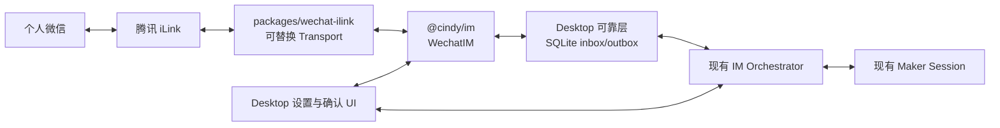

# 个人微信 IM Connector 技术设计

> 状态：`reviewed-approved`
>
> 目标交付：一个 PR、多个按层次可 review 的 commit。开发期间可以创建本地 commit，
> 但 push 和创建 PR 的时机由维护者决定。
>
> 平台范围：Desktop Windows / macOS。首版不修改 Mobile，不修改 Cindy 服务端。
>
> 合规边界：本文讨论的是腾讯 iLink 个人微信消息 Connector，不是 Cindy Mobile
> 已有的微信 Open SDK 登录。后者的合规记录见
> [`legal/wechat-open-sdk-compliance.md`](./legal/wechat-open-sdk-compliance.md)。

## 1. 目标与最终结论

Cindy 在「设置 → IM 机器人 → 个人」中增加个人微信连接。用户在系统浏览器完成
微信扫码授权后，可以从个人微信与本机 Cindy Agent 对话。

最终架构：

> 架构决策（2026-07-27）：实现形态采用更接近 FeishuBot 的 Desktop Main
> 进程内直连通道，复用共享 IM turn runner；微信模块自行负责授权、长轮询、
> durable inbox/outbox 与媒体生命周期。SlackBot 的 hook-control/WebSocket
> 控制面不进入本功能范围。



实施原则：

1. **原生客户端连接**：微信消息只在腾讯 iLink 与本机 Cindy 之间传输，不经
   Cindy 服务端，不引入 `wechat-hook-server`。
2. **不嵌入完整 OpenClaw**：只复用腾讯 MIT 仓库中与 iLink 协议直接相关的
   类型、鉴权、媒体、Markdown 规则，并保留许可证要求。
3. **Transport 可替换**：业务层不依赖腾讯当前 endpoint 细节。若未来腾讯要求
   通过 OpenClaw Host，只替换 Transport，不改 UI、队列、会话和权限层。
4. **复用现有 Agent 编排**：微信不是一套新 Agent runtime，而是 Cindy 现有
   Maker Session 的一个入站/出站渠道。
5. **可靠边界在本地 SQLite**：cursor、去重、待执行任务和待发送结果必须跨重启
   恢复，不能只依赖现有内存 `sendQueue`。
6. **高风险确认只在 Desktop**：微信不模拟交互卡片。permission、结构化 Ask、
   Plan Review 进入 Desktop；微信只显示等待提示。
7. **直接 GA 但带前置门禁**：完成技术实现不等于已获商业分发授权。腾讯/iLink
   的第三方接入、应用标识、品牌展示和分发条件未确认前不得 GA。
8. **Core 例外有明确退出条件**：当前插件沙箱不能持有后台长轮询、系统浏览器授权、
   safeStorage、owner DB 和 Maker Session ingress，因此首版进入 Desktop Core；
   vendor 协议仍隔离在独立 package。未来出现通用 IM Connector capability slot 后，
   官方微信实现应迁回插件。

## 2. 产品范围

### 2.1 首版包含

- 个人微信扫码绑定、重绑、解绑；
- Cindy Local 模式和 Cloud 模式，数据按当前 data owner 隔离；
- 每个 data owner 同时绑定一个微信；
- Windows、macOS；
- 私聊收发；
- 文本、图片、语音、文件、视频入站；
- 引用消息作为当前 turn 的补充上下文；
- typing、接收确认、长任务心跳、最终答案；
- `/new`、`/stop`、`/stop all`、`/status`、`/help`；
- 默认复用同一 Cindy 会话，`/new` 开启新上下文；
- Desktop 设置新会话默认 Agent、模型、effort、permission 和工作区；
- 本地持久队列、去重、过期、重试和重启恢复；
- 有效签名的远程兼容禁用清单。

### 2.2 首版不包含

- 群聊；
- Mobile Connector；
- Cindy 服务端消息转发；
- 主动消息、定时推送、scheduler 通知；
- 在微信中审批高风险操作；
- `/model`、`/permission`、`/ctr`、`/exctr`；
- 多微信账号；
- 完整 OpenClaw sidecar；
- 运行时下载代码或通过远程清单改变协议行为；
- 语音形式的 Agent 出站回复。

## 3. 外部依据与 Coze 对照

### 3.1 Coze 1.1.21

Coze 的 Desktop 端实现以下云端接口：

- `POST /api/coze_claw/channel/wechat/bind_start`
- `POST /api/coze_claw/channel/wechat/bind_wait`
- `POST /api/coze_claw/wechat/webhook`
- `POST /api/coze_claw/channel/wechat/unbind`

源码位置（独立 `agent-src` 归档仓，不属于本仓）：

- `coze-desktop/1.1.21/beautified/main/main.js`
  的微信 API client；
- `coze-desktop/1.1.21/beautified/renderer/static/js/index.b7a3954b13.js`
  的外部授权弹窗和等待状态。

可复用的是产品流程：

1. 先解释会跳转外部网页；
2. 系统浏览器扫码；
3. Desktop 显示等待中；
4. 成功后显示连接状态；
5. 重绑时明确会断开旧连接。

不能复用的是云端 webhook 拓扑。Cindy 首版没有服务端消息处理面。

### 3.2 腾讯 iLink

官方仓库：

- <https://github.com/Tencent/openclaw-weixin>
- <https://github.com/Tencent/openclaw-weixin/blob/v2.4.6/LICENSE>

首个实现固定的协议核对基线（获取于 2026-07-27）：

- tag：`v2.4.6`；
- commit：`cef0bfc390393f716903e16d50408118047f87e0`；
- 许可：MIT；
- 派生文件：Commit 2 按实际复制或改写的文件逐项登记；Commit 1 只有设计和协议核对
  记录，没有复制上游源码。

当前公开协议包括：

- 扫码授权；
- `getupdates` 长轮询和 `get_updates_buf` cursor；
- `sendmessage`；
- `getuploadurl`；
- `getconfig` / `sendtyping`；
- TEXT / IMAGE / VOICE / FILE / VIDEO；
- `context_token`；
- AES-128-ECB CDN 媒体。

官方插件仍带 OpenClaw Host 版本兼容约束，因此 Cindy 不依赖它的 plugin runtime，
只把稳定协议实现放进独立包。`bot_agent=Cindy/<version>` 只做观测归因，不作为
鉴权或路由依据。

实现开始前必须记录复用依据的**精确 tag/commit SHA**、获取日期和派生文件清单；
许可与行为基线不得长期指向可变的 `main`。如果实现仅依据协议重写而没有复制源码，
同样记录协议核对 commit，便于后续兼容审计。

## 4. 仓库落点

### 4.1 新增纯协议包 `packages/wechat-ilink`

建议结构：

```text
packages/wechat-ilink/
  package.json
  tsconfig.json
  src/
    types.ts
    transport.ts
    tencentIlinkTransport.ts
    auth.ts
    apiClient.ts
    poller.ts
    codec.ts
    mediaCrypto.ts
    mediaDownload.ts
    mediaUpload.ts
    markdown.ts
    chunk.ts
    errors.ts
    index.ts
    __tests__/
```

约束：

- 不依赖 Electron、Drizzle、Maker；
- 不读写 Cindy 路径；
- 不自行持久化 cursor/token；
- 网络和文件写入全部由 host 注入或明确返回字节；
- 使用 `AbortSignal` 取消授权、长轮询、上传和下载；
- 错误输出稳定 machine code，不向上层透出 token 或完整响应体。

核心接口：

```ts
export interface WechatTransport {
  beginAuthorization(signal: AbortSignal): Promise<WechatAuthChallenge>;
  waitAuthorization(
    challenge: WechatAuthChallenge,
    signal: AbortSignal,
  ): Promise<WechatCredentials>;

  poll(cursor: string, signal: AbortSignal): Promise<WechatPollResult>;
  sendMessage(request: WechatSendRequest): Promise<WechatSendResult>;

  getTypingTicket(peerId: string, contextToken: string): Promise<string>;
  setTyping(peerId: string, ticket: string, active: boolean): Promise<void>;

  downloadMedia(ref: WechatMediaRef, signal: AbortSignal): Promise<Uint8Array>;
  uploadMedia(request: WechatUploadRequest): Promise<WechatMediaRef>;
}
```

默认实现为 `TencentIlinkTransport`。

### 4.2 扩展 `packages/lizi-im`

新增：

```text
packages/lizi-im/src/wechat/
  index.ts
  ipc.ts
  inbound.ts
  outbound.ts
  status.ts
```

现有 `ChannelIM` 默认假定渠道支持交互卡片和 streaming edit，微信不支持。不能把
现有方法简单改成 optional：现有编排层会立即失去类型安全，并造成中间 commit 无法
编译。改为 discriminated output driver：

```ts
export type ImOutputDriver =
  | {
      kind: 'rich-card';
      im: RichChannelIM;
    }
  | {
      kind: 'chunked-text';
      im: TextChannelIM;
      commitFinal(args: ImFinalOutput): Promise<void>;
    };
```

`TextChannelIM` 只包含订阅、文本、文件和状态基础能力；`RichChannelIM` 在其上增加
卡片、patch 和 streaming。Feishu/Discord adapter 使用 `kind: 'rich-card'`，微信使用
`kind: 'chunked-text'`。`turnRunner` 必须按 `kind` 完成穷尽分支，不能通过 boolean
capability 后继续无条件调用卡片 API。

该 OutputDriver 只负责 Desktop 直连 IM 的输出差异。生产 Slack 仍走
`main/hook-control` + 外部 hook server，不迁入 `@cindy/im`；Slack 与直连 IM
共享的是 session 级 InteractionRouter、发送前安全屏障和 accepted/terminal 契约，
不是 transport 或消息队列实现。

该类型改造与 `turnRunner` output 分流放在**同一个 commit**，确保每个 commit 独立
typecheck。微信输出能力：

```ts
{
  kind: 'chunked-text',
  im: wechatIm,
  commitFinal,
}
```

类型变更：

- `IMMessageEvent` 增加结构化 `quote`；
- 新增 `WechatBotState`，不把微信详细状态硬塞进通用 `IMStatus`。

`IMAttachment.kind` 首版继续保持 `image | file`；音频和视频按 `kind: 'file'` +
真实 MIME 进入 model-facing/落库路径，避免无必要扩大公共契约。

### 4.3 Desktop Main

新增：

```text
apps/desktop/src/main/im/wechat/
  index.ts
  adapter.ts
  sessions.ts
  uiText.ts
  lifecycle.ts
  taskStore.ts
  taskPump.ts
  mediaStore.ts
  credentialStore.ts
  compatibilityManifest.ts
```

修改：

- `apps/desktop/src/main/im/host.ts`：创建 `wechatIm` 并加入 `createIM`；
- `apps/desktop/src/main/im/index.ts`：创建 WeChat orchestrator；
- `apps/desktop/src/main/im/shared/types.ts`：增加 `wechat` 和渠道策略；
- `apps/desktop/src/main/im/shared/turnRunner.ts`：output driver、可观测的 accepted/terminal
  执行契约和 external queue 模式；
- `apps/desktop/src/main/maker-ipc/interactionRouter.ts`：session 级中央 interaction 路由；
- `apps/desktop/src/main/im/shared/messageHandler.ts`：渠道命令策略；
- `apps/desktop/src/shared/sessionSource.ts`：增加微信 session source；
- `apps/desktop/src/shared/imDefaultSettings.ts`：增加微信默认设置；
- `apps/desktop/src/main/localDb/schema.ts`：可靠层 schema；
- 下一条正式 Drizzle migration：当前 migration 线在 `0081` 之后继续生成，
  不手工选择名称或弱化 migration 校验。

运行期多表原子操作不能在 Main 中拼接多个 awaited Drizzle 调用。必须通过 DbClient
命名 worker transaction 实现：

```text
wechatActivateBindingEpoch
wechatCommitPollBatch
wechatLeaseNextTask
wechatMarkAccepted
wechatCommitInterrupted
wechatCommitTerminal
wechatMarkOutboxDelivered
wechatRecordOutboxFailure
wechatStopAll
wechatCloseBindingEpoch
wechatUnbindCleanup
```

### 4.4 Renderer / preload

新增：

```text
apps/desktop/src/renderer/components/settings/WechatBotSection.tsx
apps/desktop/src/renderer/hooks/useWechatBot.ts
```

修改：

- `apps/desktop/src/renderer/components/settings/ImBotSection.tsx`；
- `apps/desktop/src/renderer/components/settings/ImDefaultSettingsSection.tsx`；
- `apps/desktop/src/preload/preload.ts`；
- `apps/desktop/src/renderer/vite-env.d.ts`；
- i18n 文案与 `i18n/GLOSSARY.md` / `i18n/glossary.json`。

所有 UI 同时实现 Light/Dark，颜色只能使用语义 token。

## 5. 授权、连接与生命周期

### 5.1 状态机

```text
disconnected
  -> authorizing
  -> waiting_confirmation
  -> connected
  <-> reconnecting

异常：
  needs_reauth
  disabled_by_policy
  error
```

```ts
export interface WechatBotState {
  phase:
    | 'disconnected'
    | 'authorizing'
    | 'waiting_confirmation'
    | 'connected'
    | 'reconnecting'
    | 'needs_reauth'
    | 'disabled_by_policy'
    | 'error';
  connectedAt?: number;
  lastInboundAt?: number;
  queuedTasks: number;
  errorCode?: string;
}
```

### 5.2 授权流程

1. 用户点击「连接微信」；
2. Main 获取授权 challenge；
3. Main 校验授权 URL，仅允许 HTTPS 和明确允许的腾讯域名；
4. Main 直接调用 `shell.openExternal`，Renderer 不取得 URL；
5. Main 等待扫码确认，最长 5 分钟，可取消；
6. 校验返回的 `baseUrl`、bot id、token；
7. 先写新凭证，再切换 binding generation；
8. 启动长轮询并广播 `connected`。

微信授权页可能显示 OpenClaw，这是腾讯授权页行为。Cindy 设置页在打开前说明该事实，
不修改、不套壳、不伪装授权页。

### 5.3 后台生命周期

- Window 隐藏或进入托盘不停止长轮询；
- App 退出时 abort in-flight poll；
- 网络恢复后按 `1s/2s/5s/10s/30s + jitter` 重连；
- stale token 进入 `needs_reauth`，不持续撞接口；
- data owner generation 关闭后，旧 generation 的回调不能再写凭证、DB 或发消息；
- 每次绑定生成独立随机 `bindingEpoch` UUID，不复用 owner generation；
- 所有 sync/inbox/outbox 行和命名事务都带 `bindingEpoch`；
- 每次 DB 写、凭证切换和出站发送同时校验 owner generation 与 active binding epoch；
- 新凭证先写 `wechat_credentials_<epoch>` staging key，再初始化该 epoch 的 DB state；
- `wechatActivateBindingEpoch` 以 CAS 切换 active epoch；
- CAS 成功后关闭旧 epoch，abort 并 await auth/poll/pump/outbox drain，再删除旧 secret；
- 旧 poll 即使迟到，也因 epoch CAS 失败而不能写进新绑定。

## 6. 凭证和本地数据

### 6.1 safeStorage

复用 owner-scoped IM secrets。若 `safeStorage.isAvailable() === false`，绑定入口必须
fail-closed，不允许降级成明文：

- `wechat_credentials_<bindingEpoch>`；
- `wechat_data_key_v1`。

凭证形状：

```ts
interface StoredWechatCredentials {
  botToken: string;
  ilinkBotId: string;
  baseUrl: string;
  boundAt: number;
  bindingEpoch: string;
}
```

`wechat_data_key_v1` 是随机 256-bit key，用于本地 SQLite 中敏感上下文字段的
AES-256-GCM 加密。

### 6.2 不写明文的字段

- bot token；
- context token；
- CDN AES key；
- 登录 challenge；
- 完整原始响应。

CDN AES key 只在下载/解密过程内存中存在。`context_token` 需要跨重启补发结果，
因此以 `nonce + ciphertext + tag` 写 SQLite，密钥只在 safeStorage。

### 6.3 可写本地 DB 的数据

- sync cursor；
- platform message id/seq；
- peer id；
- 消息正文和附件元数据；
- 队列状态、时间戳、重试次数；
- 脱敏错误码；
- outbox 文本。

这些数据与 Cindy 会话历史同属当前 data owner 的本地业务数据，不进入日志或云端。

## 7. SQLite 可靠层

### 7.1 `wechat_sync_state`

```text
binding_epoch PRIMARY KEY
is_active
sync_cursor
last_poll_at
last_error_code
updated_at
```

### 7.2 `wechat_inbox`

```text
id
binding_epoch
platform_message_id
platform_seq
peer_id
received_at
platform_created_at
expires_at
status
lease_until
session_id
conversation_epoch
payload_json
context_nonce
context_ciphertext
context_tag
attempts
last_error_code
```

状态：

```text
pending
dispatching
accepted_running
waiting_desktop
delivery_pending
completed
interrupted
cancelled
expired
failed_terminal
rejected_overload
```

唯一键和索引：

```text
UNIQUE(binding_epoch, platform_message_id)
INDEX(binding_epoch, status, received_at)
INDEX(binding_epoch, lease_until)
INDEX(binding_epoch, peer_id, conversation_epoch)
```

### 7.3 `wechat_outbox`

```text
id
binding_epoch
task_id
client_id
kind
chunk_index
text
media_json
status
attempts
next_retry_at
created_at
delivered_at
```

durable outbox 只保存 Agent 已生成且不能丢的 final/error/interrupted notice。ack、typing
和 heartbeat 是 best-effort 临时状态，不写 durable outbox，避免 final 已送达后恢复出
过期心跳。`client_id` 的实际唯一范围是 binding epoch，schema 使用
`UNIQUE(binding_epoch, client_id)`。

### 7.4 `wechat_file_attachments`

```text
id
binding_epoch
task_id
session_id
abs_path
original_name
mime_type
bytes
status
promoted_at
created_at
```

普通文档不进入 Cindy media blob store。它们写在 data-owner-scoped
`im-attachments/wechat/`，文件名由 task id 和随机 id 生成，原始文件名只作为展示元数据。

### 7.5 Cursor 原子边界

每个 poll batch：

1. 校验 message 类型、owner、id 和大小；
2. 去重并准备附件；
3. 使用 `blobStore.writeBlob()` 先原子发布媒体字节，但不在 Main 调
   `ingestMedia()` 拼接多次 DB 写；
4. 把 hash/ext/mime/bytes 交给 `wechatCommitPollBatch` 命名事务；
5. 该 worker transaction 中：
   - 写/触碰 `media_blobs`；
   - 插入 inbox；
   - 写媒体临时引用；
   - 写普通文件 metadata；
   - 更新 cursor；
6. commit 成功后才开始下一次 poll。

ack 不进入 durable outbox；transaction commit 返回后 Main best-effort 发送。

故障语义：

- DB transaction 失败：保留旧 cursor，下一次重拉，依赖 message id 去重；
- 媒体字节已写、transaction 失败：成为无账 blob，符合 cindy-media
  「先字节后记账」语义，由既有对账/回收策略处理；
- transaction 成功、进程在 Agent 前崩溃：启动后从 inbox 恢复；
- 不允许先推进 cursor、后异步落 inbox。

### 7.6 Queue 与 lease

- 同一 session 只允许一个 `dispatching | accepted_running | waiting_desktop |
  delivery_pending`；
- 可执行 `pending + dispatching + accepted_running + waiting_desktop` 最大 20；
- 达到上限的新消息落 `rejected_overload`，生成忙碌回复并推进 cursor；
- 每条任务 `expires_at = received_at + 30min`；
- 30 分钟 TTL 只约束尚未跨过 `beforeProviderStart` accepted 屏障的任务；
- `dispatching` 过期 lease 若确认尚未 accepted，可以回退 pending；
- `accepted_running` 在进程崩溃后必须改为 `interrupted`，**绝不自动重放**；
- `waiting_desktop` 在重启后取消 interaction，并标 `interrupted`；
- `delivery_pending` 只恢复 outbox 发送，绝不重跑 Agent；
- interrupted notice 在取得新的可用 context token 后发送；
- 只有用户明确要求重试时，才从原 payload 创建**新的 task id**；
- 一个任务失败不能卡死后续任务；
- 完成、取消、过期后释放 inbox 临时媒体引用。

Agent task 状态机：

```text
pending
  -> dispatching
  -> accepted_running
  -> waiting_desktop -> accepted_running
  -> delivery_pending
  -> completed

crash before accepted:
  dispatching -> pending

crash after accepted:
  accepted_running/waiting_desktop -> interrupted

crash after final outbox commit:
  delivery_pending -> resume outbox only
```

`finalizing` 只允许是进程内瞬时概念，不能写成 DB 状态。`wechatCommitTerminal` 必须在
同一个命名事务内完成：

```text
accepted_running
  + insert all final outbox chunks
  -> delivery_pending
```

事务前崩溃仍是 `accepted_running`，启动后改 interrupted；事务中崩溃整体回滚；事务后
崩溃一定已有完整 outbox。发现 `delivery_pending` 但没有 outbox 属于 DB invariant
violation，启动 repair 将其改为 `interrupted` 并记录安全 machine code，不能重跑 Agent。

### 7.7 Turn 执行契约与唯一队列所有权

现有 `runAgentTurn(): Promise<void>` 可能只把消息加入内存 `sendQueue` 就返回，不能作为
durable task 终态。增加不依赖回调时序的执行契约：

```ts
export type ImTurnDispatch =
  | {
      kind: 'accepted';
      sessionId: string;
      acceptedAt: number;
      terminal: Promise<ImTurnTerminal>;
    }
  | {
      kind: 'busy' | 'rejected';
      reason: string;
    };

export interface ImTurnTerminal {
  kind: 'done' | 'aborted' | 'error';
  finalText: string;
  completedAt: number;
  errorCode?: string;
}
```

约束：

- Feishu/Discord 可继续使用现有内存排队 wrapper；
- WeChat 使用 `queueMode: 'external'`，`turnRunner` 遇到 busy 只返回 `busy`，不得加入
  `sendQueue`；
- WeChat durable task pump 是微信任务的唯一排队者；
- task pump 同一 session 每次只把一条任务交给 `turnRunner`；
- Maker send path 增加 awaited `beforeProviderStart` hook。它位于 session busy guard
  通过之后、任何 provider/model/tool 执行之前；
- WeChat 的 `beforeProviderStart` 调用 `wechatMarkAccepted`，CAS 成功后任务才进入
  `accepted_running`；
- hook/CAS 失败必须让 send 返回 `rejected`，provider、model、MCP 和 tool 均不得启动；
- 现有 `onAccepted` 继续承担 user message 持久化等既有语义，不能充当安全屏障；
- DB accepted 早于 provider 真正启动会产生“保守中断”窗口：若此刻崩溃，任务仍按
  interrupted 处理而不自动重放，这是有意的副作用安全取舍；
- task pump 必须等待 `terminal`；
- `terminal` 不能复用现有早于最终输出收集的 `onTurnComplete`；
- `wechatCommitTerminal` 在一个命名事务内写全部 final outbox，并把 inbox 改为
  `delivery_pending`；
- 该事务提交后才能考虑下一条任务；
- 同 peer 存在 `delivery_pending` 时，先完成 outbox；没有新 context token 时保持阻塞，
  不重新运行 Agent；
- 所有 final chunk 送达后，`wechatMarkOutboxDelivered` 才把任务改为 `completed`。

## 8. 会话路由与命令

### 8.1 会话

- `sessions.source = 'wechat'`；
- 默认 `workspaceKind = 'dialogue'`；
- 默认工作目录是 Cindy 托管的 IM dialogue 目录；
- 用户可在 Desktop 选择一个已登记项目，选择只影响之后的新上下文；
- session id 按 `botContextId + peerId` 确定性生成；
- `/new` 不新建无限 session row，而是重置 SDK 上下文并增加
  `conversation_epoch`；
- 现有历史继续保留在 Cindy 会话中。

### 8.2 新会话默认

`im-default-settings.json` 从 v2 升到 v3：

- channel 增加 `wechat`；
- `ImDefaultSettings` 增加 `permissionMode`，默认 `auto`；
- 旧文件缺字段时 normalize 为 `auto`；
- Feishu/Discord/Slack 行为不变；
- full access 设置只作用于新上下文。

微信独有的项目选择放在 owner-scoped `wechat-channel.json`，不扩散到其它 IM。

### 8.3 命令

微信命令采用显式 allowlist：

- `/new`；
- `/stop`；
- `/stop all`；
- `/status`；
- `/help`。

命令不作为普通 Agent 消息：

- `/stop` 立即 abort 当前 task，保留后续 pending；
- `/stop all` abort 当前 task，并原子取消全部 pending；
- `/status`、`/help` 立即回复；
- `/new` 作为 FIFO 会话边界，边界后的任务使用新 epoch；
- 其它 `/xxx` 回复 unknown command，不进入 Agent。

## 9. Interaction 与权限

### 9.1 中央 InteractionRouter

Maker Session 的 interaction listener 是覆盖式单 listener，不能继续让 Desktop、
Feishu、Discord 和 WeChat 互相安装/还原 listener。新增 session 级中央
`InteractionRouter`：

```ts
type TurnOrigin =
  | { kind: 'desktop' }
  | { kind: 'im'; channel: 'feishu' | 'discord' | 'slack' | 'wechat'; taskId?: string }
  | { kind: 'scheduler' }
  | { kind: 'hook'; source: string };

interface InteractionRoute {
  sessionId: string;
  turnId: string;
  origin: TurnOrigin;
  interactionSurface: 'desktop' | 'channel-card' | 'headless';
  onStateChange?(state: 'waiting' | 'resolved' | 'cancelled'): void;
}
```

规则：

- 每个 Maker Session 只安装一次 Router listener；
- Desktop、IM、scheduler、hook 在 turn dispatch 时登记 origin；
- Desktop turn → Desktop UI；
- WeChat turn → Desktop UI，同时通知对应 durable task observer；
- Feishu/Discord turn → 对应渠道卡片；
- 无法识别/已过期 turn → 安全拒绝；
- request id 到 route 一次性绑定；
- abort、timeout、解绑、owner/binding epoch 关闭统一经 Router resolve 一次；
- 渠道不得再直接 `setInteractionListener()` 抢占；
- 现有 detach 流程不再负责“恢复 Desktop listener”。

微信行为：

1. permission、结构化 Ask、Plan Review 使用 Desktop interaction listener；
2. 微信发送「任务正在等待你在 Cindy 中确认」；
3. inbox 状态改为 `waiting_desktop`；
4. 最长等待 30 分钟；
5. `/stop` 可以取消等待；
6. 超时后 permission/plan 拒绝，Ask 以取消结束，不无限占住队列；
7. turn 收口后继续派发下一条。

### 9.2 高风险工具策略前移

只在 `turnRunner.handleInteractionFor()` 检查 destructive 不足以兑现安全承诺：
Claude MCP auto-approve 和 Full Access 可能根本不产生 interaction。新增按 turn origin
注入的 Maker 权限策略：

```ts
interface TurnPermissionPolicy {
  origin: TurnOrigin;
  forceConfirmToolCall(toolName: string, input: unknown): boolean;
  confirmationSurface: 'desktop' | 'channel';
}
```

执行边界：

- policy 随 `session.send()` 的本次 turn 传入，不写进 system prompt；
- Claude Code 在 `canUseTool` 与 MCP auto-approve **之前**执行
  `forceConfirmToolCall`；
- Codex policy turn 使用可被 host 观察的 `untrusted + read-only` turn 配置，并在
  approval 自动放行之前执行同一策略；
- 微信 origin 命中 destructive classifier 时强制生成 Router permission request；
- session permission mode 为 `auto` 时，微信 origin 的高风险命中不能绕过 Desktop
  确认；
- 非微信 turn 保持现有权限行为；
- provider 若无法提供强制确认前置钩子，该 provider 的微信 Full Access 不可选，
  不能静默降级；
- 这项改动进入 `maker-core` Agent 行为边界，实施时必须按
  `docs/dev-rules/maker-core-and-agent-behavior.md` 验证 Claude/Codex 两条路径。

现有 destructive guard 对其它渠道继续直接 deny。微信的旧 guard 仅作为 defense in
depth，真正保证来自 Maker/Agent 权限入口。

Full Access：

1. 当前 Claude/Codex adapter 都无法证明 Full Access 下每一种文件删除会在执行前回调
   host，因此个人微信首版明确禁用 Full Access；
2. capability 对外声明不支持的 permission mode，dispatch preflight 在任何 durable
   accepted/CAS/消息落库之前拒绝，不静默降级成 Auto；
3. 将来只有 provider 提供覆盖所有工具执行的前置 hook 并完成回归后，才能重新开放；
4. 届时仍需 Desktop 二次风险确认、只写新会话默认且 `/new` 后生效。

## 10. 文本与回复

### 10.1 输出策略

微信不尝试模拟卡片 streaming edit：

1. inbox commit 后发 ack；
2. 获取 typing ticket 并开启 typing；
3. Agent 运行；
4. 60 秒未完成时发第一条可见心跳；
5. 之后最多每 2 分钟一条；
6. structured interaction 时发等待 Desktop 提示；
7. turn 结束，关闭 typing；
8. Markdown filter；
9. 代码块感知地切成不超过 3500 字符；
10. 写 durable outbox 并发送 final。

ack、typing、heartbeat 都是进程内 best-effort 状态；进程重启后不恢复它们。只有
final/error/interrupted notice 写 durable outbox。

### 10.2 重试与新 token 补发

- 每个 outbox chunk 固定一个 `client_id`；
- 同一 chunk 最多即时重试 3 次；
- 失败后保持 pending，不重复生成 Agent 回答；
- 下一条同 peer 入站带来新 `context_token` 后，先补发旧 final；
- 补发结束后才执行新任务；
- Agent terminal 到 final outbox 的写入与 inbox `delivery_pending` 状态更新必须在
  `wechatCommitTerminal` 同一命名事务；
- retry 复用原 `client_id`；
- ack/heartbeat 失败不阻塞 Agent，final 失败必须进入 outbox。

### 10.3 Markdown

- 复用/移植腾讯官方 Markdown filter 的协议相关规则；
- 不直接复制 OpenClaw runtime glue；
- 3500 是 Cindy 上限，低于官方插件当前 4000；
- chunker 必须保持 fenced code block 成对；
- 无法保持时在 chunk 边界补 fence，并在下一 chunk 重开；
- 不切断 surrogate pair、组合字符和 Markdown 链接目标。

## 11. 入站媒体与引用

### 11.1 限制

- 每条最多 4 个附件；
- 单个明文最大 5 MB；
- 读取流执行硬上限，不信任 Content-Length；
- 总上限自然为 20 MB；
- 超出部分写 `unsupported`，其它文本/附件继续执行；
- 下载失败不能阻塞整个 poll batch；
- URL 必须 HTTPS 且命中允许域；
- AES key 长度、padding、MD5/size 均验证。

### 11.2 Cindy media 边界

进入 cindy-media：

- image；
- audio；
- video。

不进入 cindy-media：

- PDF、Office、压缩包和其它普通文件。

媒体入仓时挂 `im-inbox` 临时引用。Maker 接受 user message 后，现有
`persistUserMessage()` 仍可能吞掉落库失败，因此不能仅凭 Agent accepted 删除临时引用。

晋升协议：

1. user message 落库返回成功；
2. 确认对应 cindy-media hash 已有目标 session 的 `session-attachment` ref；
3. 命名事务/repair 操作把附件标记 promoted；
4. 最后删除 `im-inbox` ref；
5. 任一步失败都保留 `im-inbox` ref 和 `repair_required` 状态；
6. 启动 repair 重试晋升，不删除用户附件。

为此给 `MediaRefKind` 增加 `im-inbox`，不改变底层 SQLite 列类型。

普通文件：

- 入站时状态 `staged`；
- user message 成功落库后改为 `promoted` 并写 `promoted_at/session_id`；
- Agent 使用受控 `xdt-file` URL 或同等级 root grant，不把任意裸绝对路径暴露给
  Renderer；
- session 删除时清理对应 promoted 文件；
- 解绑只删除 staged 文件，不能删除已进入 session history 的文件；
- DB cleanup transaction 返回待删路径，Main 做 root containment、symlink 和 epoch
  校验后再删除字节。

### 11.3 语音

- 微信提供 transcript 时，把 transcript 放入当前 turn；
- 原始 SILK 在 Worker 内转 WAV，不能阻塞 Electron Main；
- WAV 进入 cindy-media；
- 转码失败时保留 transcript，并将音频标成 unsupported；
- 没有 transcript 且转码失败时，不调用 Agent，直接提示暂不能处理。

### 11.4 引用消息

```ts
interface IMQuote {
  authorLabel?: string;
  text?: string;
  attachments?: IMAttachment[];
}
```

quote 只注入本次 model-facing `UserMessage`，不伪造成上一条历史消息。用户消息落库
可保存 quote metadata 供 UI 展示，但 session transcript 的顺序不改变。

## 12. 网络与 Electron 安全

所有网络请求在 Main：

- Renderer 不收 token、context token、AES key、base URL 或原始事件；
- 协议包只使用 Main 注入的 HTTP client，Desktop 实现使用 Electron `net.fetch`，
  包内不直接使用全局 fetch；
- 授权 URL 由 Main 校验后直接 `shell.openExternal`；
- 登录返回的 base URL 不能直接信任；
- API host 与 CDN host 使用独立 allowlist；
- auth/API 请求禁用自动重定向；
- 媒体若协议确需重定向，逐跳手工处理并重新校验 scheme、host、端口和跳数；
- 禁止 localhost、私网 IP、`file:`、自定义协议；
- auth、poll 和错误响应设置严格字节上限；
- 单个 poll batch 设置最大消息数和最大 item 数，超过时以协议错误处理，不能无界
  `JSON.parse` 后继续分配；
- `payload_json` 只保存字段 allowlist 后的 normalized payload，禁止放原始 response
  或 `raw`；
- 日志只记录 endpoint 类别、状态码、错误码、长度和脱敏 id 后缀；
- 不记录 query、Authorization、context token、完整 message body；
- error 类型只能携带稳定 machine code 和安全参数，禁止直接 `String(err)` 记录可能包含
  URL、header 或 body 的底层网络错误；
- 媒体文件名不使用平台提供的原始路径；
- 普通文件落盘前做 root containment、symlink 和最终绝对路径校验。

`X-WECHAT-UIN` 每次请求重新生成。`bot_agent` 固定从构建版本生成，不接受远程或用户
输入。

## 13. 兼容禁用 Manifest

Manifest 只允许停用，不允许修改 endpoint、协议参数或下载代码：

```json
{
  "schemaVersion": 1,
  "sequence": 1,
  "generatedAt": 0,
  "expiresAt": 0,
  "rules": [
    {
      "minVersion": "1.0.0",
      "maxVersion": "1.2.0",
      "action": "disable",
      "reason": "Tencent protocol incompatible",
      "helpUrl": "https://..."
    }
  ],
  "signature": "..."
}
```

规则：

- 使用独立 Ed25519 key，不能复用更新器签名 key；
- 只接受内置 manifest URL；
- 文件最大 32 KiB，Content-Type 和最终字节数都验证；
- 使用仓库固定的 canonical JSON 规则签名，`signature` 字段不参与 payload；
- 签名覆盖 schemaVersion、sequence、生成/过期时间和全部 rules；
- 增加单调递增 `sequence`，拒绝低于最近有效 sequence 的回滚 manifest；
- 网络失败 fail-open；
- 有效签名、未过期、版本命中时才 disable；
- 缓存放 owner 无关的受控配置目录，原子写；最后一个有效 manifest 过期后不再生效；
- disable 只停止 auth/poll/send，保留凭证、设置和会话；
- UI 显示稳定本地文案，远程 `reason` 只作为诊断码，不直接渲染任意 HTML/Markdown。
- `helpUrl` 只能从内置可信域和固定 path 前缀中选择，远程值不能任意打开。

## 14. 解绑语义

解绑顺序：

1. `wechatCloseBindingEpoch` CAS 把 active epoch 改为 closed，之后所有旧写入失败；
2. abort auth、poll、typing、task pump、outbox sender；
3. await 这些 epoch-scoped operation 的 drain promise，不能只发 abort 不等待；
4. best-effort 调用腾讯支持的 stop/revoke；
5. `wechatUnbindCleanup` 命名事务删除 sync、inbox、outbox、未晋升 file metadata 和
   `im-inbox` refs，并返回待删普通文件路径；
6. Main 对返回路径做 root containment 后删除 staged 文件；
7. 删除 `wechat_credentials_<epoch>`；
8. 只有当前 owner 不再有任何 WeChat epoch/context 密文时，才删除
   `wechat_data_key_v1`；
9. 广播 disconnected。

保留：

- 已创建 Cindy session；
- 已落入 session 历史的消息；
- 已挂 `session-attachment` 的媒体；
- 非敏感默认 Agent/模型/项目设置。

删除：

- token；
- context token 密文和本地 data key；
- cursor；
- pending/running queue；
- pending outbox；
- 未提交附件；
- 登录 challenge。

## 15. 可观测性

只使用本地脱敏日志：

- auth phase；
- poll latency、消息数量；
- cursor 长度，不记 cursor；
- queue depth；
- task 状态迁移；
- outbox retry 次数；
- media 类型、明文大小、处理耗时；
- error machine code；
- peer/message/task id 只显示短 hash。

首版不增加云端 analytics，不上报微信绑定状态、消息量、内容或错误响应体。

## 16. 测试策略

### 16.1 `packages/wechat-ilink`

- QR challenge 和状态轮询；
- headers 与 `X-WECHAT-UIN`；
- abort；
- API error 分类；
- stale token；
- getupdates cursor；
- 五种 MessageItem；
- AES 解密/加密 fixture；
- Markdown filter；
- 3500 chunk 和 code fence；
- media size cap；
- URL allowlist。

### 16.2 Desktop Main

- 使用 fake iLink server，不访问真实腾讯；
- inbox + cursor 原子提交；
- duplicate batch；
- transaction fail；
- crash injection；
- crash before accepted 可恢复；
- crash after accepted 只标 interrupted、绝不重放工具；
- crash after final outbox commit 只恢复发送；
- lease recovery；
- 30 分钟 TTL；
- queue 20 上限；
- `/stop` / `/stop all`；
- outbox 三次重试；
- 新 context token 补发；
- owner generation 切换；
- binding epoch staging/CAS/drain；
- 旧 poll/outbox 回调在 rebind 后写入失败；
- Local/Cloud 数据隔离；
- token/context 不出现在日志和 IPC；
- media 临时引用晋升；
- unbind 清理；
- migration replay 和 compatibility。

### 16.3 Orchestrator

- 微信不调用 card API；
- rich-card/chunked-text discriminated union 穷尽；
- session 只安装一个 InteractionRouter listener；
- Desktop/Feishu/Discord/WeChat origin 路由互不抢占；
- Desktop interaction 正常 resolve；
- 30 分钟超时；
- destructive 强制 Desktop 确认；
- Claude MCP auto-approve 前强制确认；
- Claude/Codex Full Access 微信 turn 在 durable accept 前明确拒绝；
- 当前 task 与 pending 串行；
- `/new` epoch 边界；
- final outbox 只生成一次。

### 16.4 Renderer

- 授权状态；
- 取消、超时、重试、重绑、解绑；
- needs reauth；
- disabled by policy；
- Local 和 Cloud 可见性；
- Full Access 不可选原因文案；
- i18n；
- Light/Dark。

### 16.5 手工矩阵

- Windows/macOS；
- 前台、隐藏窗口、托盘；
- 睡眠唤醒；
- 断网/恢复；
- 首次绑定、同微信重绑、不同微信顶替；
- stale token；
- 五种媒体；
- 超大文件；
- 30 分钟 backlog；
- Desktop permission 打开/关闭窗口；
- 解绑后重启；
- manifest disable。

## 17. 单 PR、多 commit 计划

一个 commit 只承担一个可独立 review 的职责。不得把后续层的占位实现混进前一层。
每个 commit 都带 DCO sign-off，并在创建前跑仓库规定的完整提交门禁。

### Commit 1：设计文档与协议/合规基线

建议标题：

```text
docs: design personal WeChat IM connector
```

内容：

- 本设计文档；
- 固定上游 tag、commit SHA、获取日期、许可和派生登记规则；
- 本 commit 没有引入第三方代码或依赖，因此不生成新的第三方 NOTICE；Commit 2 按实际
  复制/改写清单更新 NOTICE 和 SBOM；
- 不含运行时代码。

验证：

- 文档链接；
- Markdown/Mermaid 目检；
- 若只改 docs，提交前仍按仓库硬门禁跑完整 `pnpm test:unit`。

### Commit 2：iLink 纯协议包

建议标题：

```text
feat(wechat): add isolated iLink protocol package
```

内容：

- `packages/wechat-ilink`；
- auth/API/types/codec/crypto/markdown/chunk；
- fake server/fixture 单测；
- MIT NOTICE。

不包含：

- Electron；
- SQLite；
- UI；
- Cindy session。

### Commit 3：可靠存储与 migration

建议标题：

```text
feat(desktop): persist WeChat inbox and outbox
```

内容：

- schema/migration；
- task store 和全部 named worker transaction；
- binding epoch schema/index；
- cursor + inbox + media ledger transaction；
- context token 本地加密；
- accepted/interrupted/delivery_pending 状态机；
- lease/TTL/recovery；
- migration 与 crash 测试。

不包含：

- 设置 UI；
- Maker turn；
- 媒体完整支持。

### Commit 4：OutputDriver 与中央 InteractionRouter

建议标题：

```text
refactor(im): centralize output and interaction routing
```

内容：

- `TextChannelIM` / `RichChannelIM` 与 discriminated `ImOutputDriver`；
- `turnRunner` rich-card/chunked-text 穷尽分流；
- accepted/terminal execution contract；
- awaited `beforeProviderStart` 安全屏障；
- external queue 模式；
- session 级中央 `InteractionRouter`；
- Desktop/Feishu/Discord 与 Slack `hook-control` origin 路由迁移；
- 现有渠道全量回归。

该 commit 不接微信真实网络，但必须独立编译，且现有渠道行为不变。

### Commit 5：按 turn origin 的权限策略与 Desktop 确认

建议标题：

```text
feat(maker): enforce IM-origin desktop confirmations
```

内容：

- Claude/Codex `TurnPermissionPolicy`；
- MCP auto-approve 前置拦截；
- Auto destructive 强制确认，Full Access 在 durable accept 前明确拒绝；
- WeChat origin → Desktop InteractionRouter 路由能力，但尚不接真实微信网络；
- waiting/timeout/abort/epoch close；
- provider capability gate；
- maker-core 和 Desktop 回归测试。

该 commit 完成前不得接通微信 Agent turn，避免存在默认 `auto` 但高风险策略尚未生效的
中间提交。

### Commit 6：WechatIM、binding epoch 与文本 task pump

建议标题：

```text
feat(im): add personal WeChat text channel lifecycle
```

内容：

- WechatIM；
- owner-scoped epoch credentials；
- auth IPC；
- binding staging/CAS/drain；
- poll lifecycle；
- `createIM` 接线；
- `wechat` source/namespace；
- durable task pump；
- task pump 作为唯一微信队列；
- command allowlist；
- `/new`、stop/status/help；
- default permission migration；
- 启用 Commit 5 已存在的微信 origin 权限策略。

首版在该 commit 只要求纯文本任务进入 Agent；媒体保持 unsupported，不放未完成占位。

### Commit 7：媒体与出站可靠性

建议标题：

```text
feat(wechat): support media and reliable replies
```

内容：

- 图片/音频/视频 cindy-media；
- 普通文件受控存储；
- SILK Worker；
- quote；
- typing/heartbeat；
- outbox retry/new-token recovery；
- media/file promotion 与 repair；
- session 文件清理；
- cleanup tests。

### Commit 8：设置 UI 与 i18n

建议标题：

```text
feat(settings): add personal WeChat connector controls
```

内容：

- WechatBotSection/useWechatBot；
- preload/renderer types；
- Agent/模型/项目/permission；
- Full Access 禁用与不可选原因文案；
- Light/Dark；
- 中英文/i18n glossary；
- UI tests。

### Commit 9：兼容熔断与 GA hardening

建议标题：

```text
feat(wechat): add signed compatibility disable policy
```

内容：

- signed manifest；
- security/adversarial tests；
- release docs；
- final NOTICE/compliance checklist；
- cross-platform fixes。

## 18. 每个 commit 的执行门禁

仓库硬门禁：

```text
pnpm test:unit
pnpm --filter <本次涉及的每个 package> run --if-present typecheck
```

典型 package：

```text
pnpm --filter desktop run --if-present typecheck
pnpm --filter @cindy/im run --if-present typecheck
pnpm --filter @cindy/wechat-ilink run --if-present typecheck
```

UI/i18n commit 追加：

```text
pnpm check:i18n-glossary
```

schema/migration commit 追加：

```text
pnpm --filter desktop db:validate
pnpm --filter desktop test:migration-replay
```

提交：

```text
git commit -s
```

执行约束：

- 测试失败不得创建正常 commit；
- 不跳过、不删除、不弱化测试；
- 每个 commit 创建前 review staged diff；
- 不在本计划中 push；
- 不创建 PR；
- 最终 PR 使用 `.github/PULL_REQUEST_TEMPLATE.md`；
- PR 时机和最终 push 由维护者决定。

## 19. 阶段退出条件

### Phase 0：协议与合规 Spike

- 腾讯允许的第三方接入边界已确认；
- Windows/macOS 至少完成文本收发 PoC；
- 授权页 OpenClaw 展示已被产品接受；
- 若必须使用 OpenClaw Host，Transport 替换结论已记录。

### Phase 1：协议核心

- fake server 下 auth/poll/send/media 单测通过；
- 没有 Electron/DB 依赖；
- MIT NOTICE 完成。

### Phase 2：可靠收发

- crash/restart 不丢消息；
- cursor 不先于 inbox；
- 同消息不会执行两次；
- accepted 后崩溃只产生 interrupted，不自动重跑 Agent/工具；
- final outbox 已提交后只恢复发送；
- 30 分钟 TTL 和 queue 20 生效；
- final 可在新 context token 到达后补发。

### Phase 3：Cindy Agent

- 微信消息进入现有 Maker Session；
- session history 正常；
- 微信不调用 card API；
- durable pump 与 `turnRunner.sendQueue` 不形成双重队列；
- InteractionRouter 单 listener 正确路由所有 origin；
- Auto 下微信高风险工具仍进 Desktop；
- Full Access 在 provider capability gate 被明确拒绝；
- Desktop interaction 可完成和超时；
- `/new` 和 stop 语义稳定。

### Phase 4：产品完成

- 五种入站类型；
- 设置页完整；
- Light/Dark 与 i18n；
- 解绑完整清理；
- Windows/macOS 回归。

### Phase 5：GA

- 腾讯/iLink 接入条件和发行地区已签核；
- signed disable policy 演练完成；
- 隐私、NOTICE、用户帮助文档完成；
- 最终 PR 无 P0/P1 review 问题。

## 20. 已知风险与发布阻塞项

1. **腾讯接入授权**：MIT 代码许可不自动等于 iLink 商业服务授权；不得预设一定存在
   某种独立 App ID，以腾讯确认的第三方接入、应用标识、品牌展示和分发条件为准。
2. **OpenClaw 品牌展示**：绑定页由腾讯控制，Cindy 只能提前解释。
3. **服务端 cursor 保留期未知**：本地 cursor 能解决客户端崩溃，不能承诺超过腾讯
   服务端保留窗口后补齐全部历史。
4. **context token 时效**：首版限制为 reply-only，并用新入站 token 补发旧 final。
5. **重绑排他性**：新连接可能解除旧 OpenClaw/Cindy 连接，UI 必须明确告知。
6. **协议变化**：只允许签名 disable，不允许远程热修协议。
7. **普通文件生命周期**：必须有 session 归属和删除清理，不能复制后永久遗留。
8. **Main 性能**：SILK、AES、大文件 hash 必须在 Worker 或流式路径，不能阻塞 Electron。
9. **工具副作用不可自动重放**：accepted 后崩溃只能中断并让用户显式重试。
10. **上游漂移**：实现和 NOTICE 必须固定到精确 tag/commit，升级单独 review。

## 21. Review 清单

Subagent review 至少检查：

- 是否违反仓库产品原则或客户端/服务端边界；
- 是否误用 cindy-media 存普通文件；
- cursor/inbox/outbox 崩溃边界是否闭合；
- accepted 后是否存在任何自动重放路径；
- context token 是否可能明文落盘或进入日志；
- InteractionRouter 是否真正消除了 listener 抢占；
- durable queue 是否会和现有 turnRunner 内存队列形成双重乱序；
- owner generation、解绑、重绑是否存在陈旧回调；
- `TextChannelIM/RichChannelIM + ImOutputDriver` 改造是否破坏 Feishu/Discord；
- migration 是否可 replay、可从旧库升级；
- commit 切分是否存在不可编译的中间 commit；
- named worker transaction 是否覆盖全部跨表原子边界；
- Claude/Codex Auto、MCP auto-approve 是否都经过 origin policy，Full Access 是否在
  accepted 前被 capability gate 拒绝；
- GA gate 是否把技术完成误写为外部授权完成。

## 22. 独立 Review 记录

2026-07-27 由独立 subagent 对照当前仓库代码和规则完成两轮对抗性 review。

第一轮发现并要求修复：

- accepted 后崩溃自动重放工具副作用；
- durable queue 与 `turnRunner.sendQueue` 双重所有权；
- Maker Session 单 interaction listener 抢占；
- Auto/MCP auto-approve/Full Access 绕过高风险确认；
- binding epoch、命名事务、媒体晋升和中间 commit 编译边界。

第二轮确认：

- `beforeProviderStart` 已成为 provider/tool 前 awaited accepted 屏障；
- 持久 `finalizing` 已删除，terminal outbox 与 `delivery_pending` 同事务；
- origin 权限策略先于真实 WeChat Agent 接线落地；
- 无剩余 P0/P1，可以进入实现。
